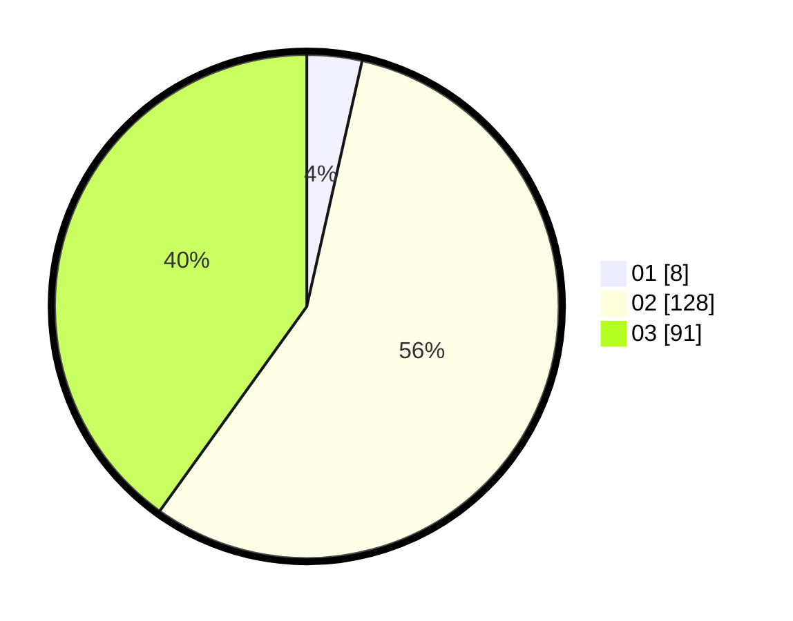

# Hasil

Hasil perolehan suara paslon dapat dilihat pada file paslon-01.txt, paslon-02.txt, dan paslon-03.txt.

Jika tidak ada, artinya data tersebut belum ada pada SIREKAP.

## Perolehan Suara

 * Paslon 01: **8**.
 * Paslon 02: **128**.
 * Paslon 03: **91**.

## Foto C Plano

https://sirekap-obj-formc.kpu.go.id/c49e/pemilu/ppwp/31/72/02/10/06/3172021006201-20240214-213327--f116aeb9-d6f6-4c17-9077-bf214278e41d.jpg

https://sirekap-obj-formc.kpu.go.id/c49e/pemilu/ppwp/31/72/02/10/06/3172021006201-20240214-191428--8e5c22cb-5bda-4164-b917-a39da187301f.jpg

https://sirekap-obj-formc.kpu.go.id/c49e/pemilu/ppwp/31/72/02/10/06/3172021006201-20240214-191504--c73842e0-18a7-4f26-9fd3-fd02e2932a30.jpg
