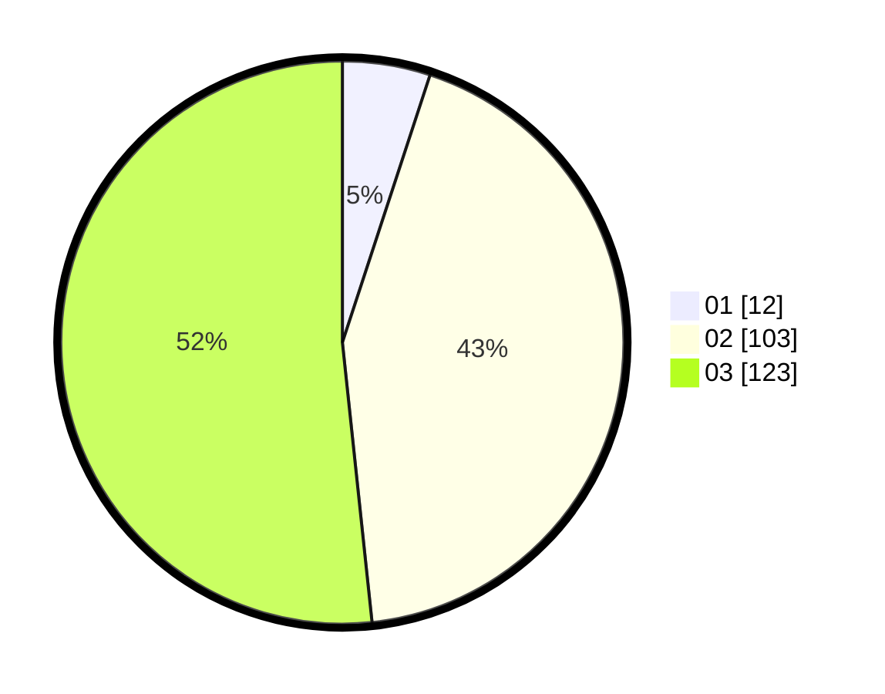

# Hasil

Hasil perolehan suara paslon dapat dilihat pada file paslon-01.txt, paslon-02.txt, dan paslon-03.txt.

Jika tidak ada, artinya data tersebut belum ada pada SIREKAP.

## Perolehan Suara

 * Paslon 01: **12**.
 * Paslon 02: **103**.
 * Paslon 03: **123**.

## Foto C Plano

https://sirekap-obj-formc.kpu.go.id/ba01/pemilu/ppwp/31/72/02/10/06/3172021006216-20240214-223004--24cda894-3807-4ccb-a3ce-0b4935599565.jpg

https://sirekap-obj-formc.kpu.go.id/ba01/pemilu/ppwp/31/72/02/10/06/3172021006216-20240214-223034--f62b0f98-e7e4-4c8b-888c-6192ba2adce4.jpg

https://sirekap-obj-formc.kpu.go.id/ba01/pemilu/ppwp/31/72/02/10/06/3172021006216-20240216-151704--3f25a5c2-1cab-431c-8a46-365d30e4796c.jpg

## DATA PEMILIH TETAP

Jumlah pemilih dalam DPT: **295**.
 * L: **127**.
 * P: **168**.

## DATA PENGGUNA HAK PILIH

Jumlah pengguna hak pilih dalam DPT: **234**.
 * L: **104**.
 * P: **130**.

Jumlah pengguna hak pilih dalam DPTb: **3**.
 * L: **1**.
 * P: **2**.

Jumlah pengguna hak pilih dalam DPK: **3**.
 * L: **1**.
 * P: **2**.

Jumlah pengguna hak pilih: **240**.
 * L: **106**.
 * P: **134**.

## JUMLAH SUARA SAH DAN TIDAK SAH

JUMLAH SELURUH SUARA SAH: **238**.

JUMLAH SUARA TIDAK SAH: **2**.

JUMLAH SELURUH SUARA SAH DAN SUARA TIDAK SAH: **240**.
