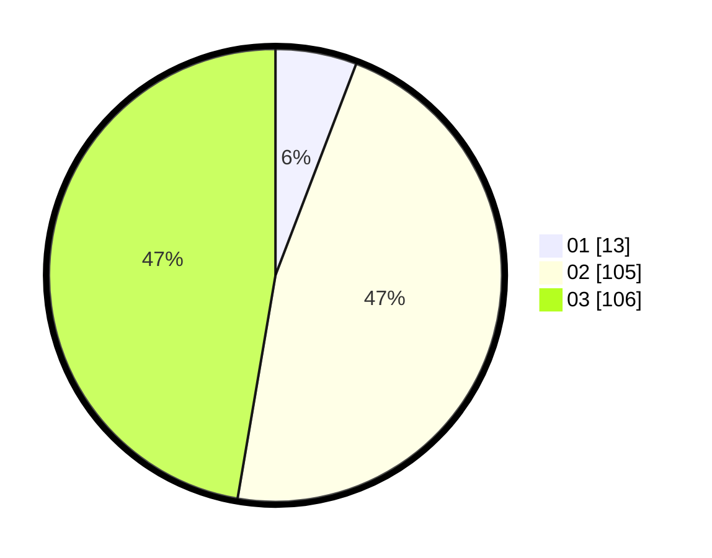

# Hasil

Hasil perolehan suara paslon dapat dilihat pada file paslon-01.txt, paslon-02.txt, dan paslon-03.txt.

Jika tidak ada, artinya data tersebut belum ada pada SIREKAP.

## Perolehan Suara

 * Paslon 01: **13**.
 * Paslon 02: **105**.
 * Paslon 03: **106**.

## Foto C Plano

https://sirekap-obj-formc.kpu.go.id/75bc/pemilu/ppwp/31/72/02/10/06/3172021006219-20240214-195602--4a647780-0bd7-4a07-9744-06e6ea410afc.jpg

https://sirekap-obj-formc.kpu.go.id/75bc/pemilu/ppwp/31/72/02/10/06/3172021006219-20240214-195626--cba1215f-9d87-496d-9913-c86421061718.jpg

https://sirekap-obj-formc.kpu.go.id/75bc/pemilu/ppwp/31/72/02/10/06/3172021006219-20240214-195644--161c556a-fa86-46e7-b769-1e74d432489b.jpg

## DATA PEMILIH TETAP

Jumlah pemilih dalam DPT: **293**.
 * L: **153**.
 * P: **140**.

## DATA PENGGUNA HAK PILIH

Jumlah pengguna hak pilih dalam DPT: **216**.
 * L: **108**.
 * P: **108**.

Jumlah pengguna hak pilih dalam DPTb: **2**.
 * L: **1**.
 * P: **1**.

Jumlah pengguna hak pilih dalam DPK: **6**.
 * L: **2**.
 * P: **4**.

Jumlah pengguna hak pilih: **224**.
 * L: **111**.
 * P: **113**.

## JUMLAH SUARA SAH DAN TIDAK SAH

JUMLAH SELURUH SUARA SAH: **224**.

JUMLAH SUARA TIDAK SAH: **0**.

JUMLAH SELURUH SUARA SAH DAN SUARA TIDAK SAH: **224**.
