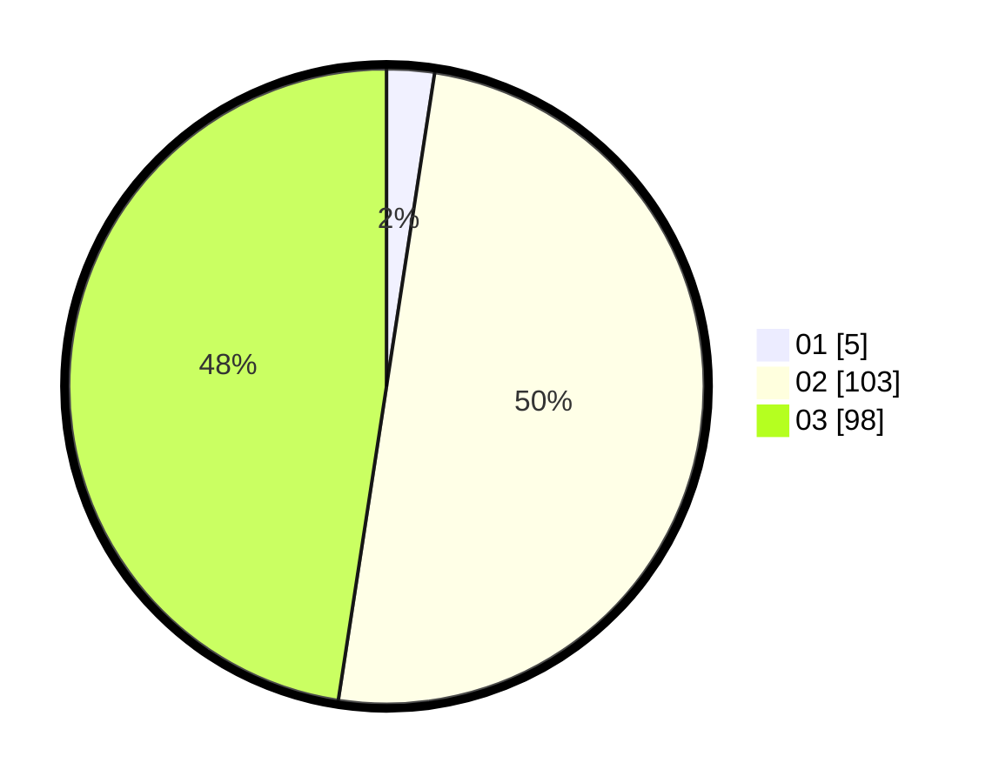

# Hasil

Hasil perolehan suara paslon dapat dilihat pada file paslon-01.txt, paslon-02.txt, dan paslon-03.txt.

Jika tidak ada, artinya data tersebut belum ada pada SIREKAP.

## Perolehan Suara

 * Paslon 01: **5**.
 * Paslon 02: **103**.
 * Paslon 03: **98**.

## Foto C Plano

https://sirekap-obj-formc.kpu.go.id/81e7/pemilu/ppwp/31/72/02/10/06/3172021006221-20240214-190031--c04a86e9-a2b9-4a94-9e02-0471b051434c.jpg

https://sirekap-obj-formc.kpu.go.id/81e7/pemilu/ppwp/31/72/02/10/06/3172021006221-20240214-190109--ec844388-611b-47bb-8a74-674a0a6ffa54.jpg

https://sirekap-obj-formc.kpu.go.id/81e7/pemilu/ppwp/31/72/02/10/06/3172021006221-20240214-190229--ffd05fa6-e0cc-4cc9-9c88-5be3243a6c0e.jpg

## DATA PEMILIH TETAP

Jumlah pemilih dalam DPT: **282**.
 * L: **139**.
 * P: **143**.

## DATA PENGGUNA HAK PILIH

Jumlah pengguna hak pilih dalam DPT: **208**.
 * L: **100**.
 * P: **108**.

Jumlah pengguna hak pilih dalam DPTb: **1**.
 * L: **0**.
 * P: **1**.

Jumlah pengguna hak pilih dalam DPK: **0**.
 * L: **0**.
 * P: **0**.

Jumlah pengguna hak pilih: **209**.
 * L: **100**.
 * P: **109**.

## JUMLAH SUARA SAH DAN TIDAK SAH

JUMLAH SELURUH SUARA SAH: **206**.

JUMLAH SUARA TIDAK SAH: **3**.

JUMLAH SELURUH SUARA SAH DAN SUARA TIDAK SAH: **209**.
