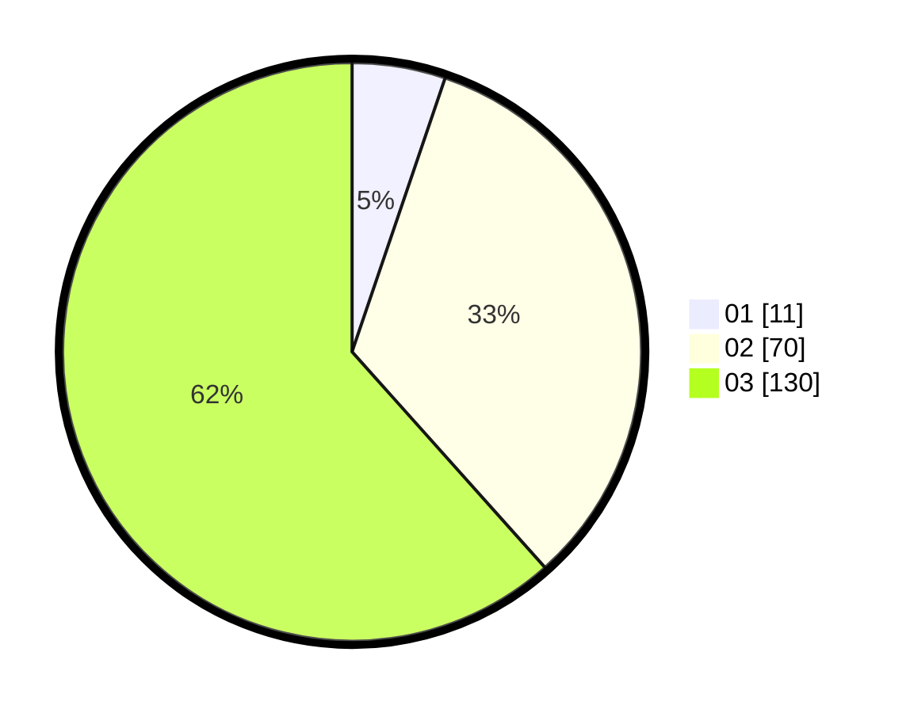

# Hasil

Hasil perolehan suara paslon dapat dilihat pada file paslon-01.txt, paslon-02.txt, dan paslon-03.txt.

Jika tidak ada, artinya data tersebut belum ada pada SIREKAP.

## Perolehan Suara

 * Paslon 01: **11**.
 * Paslon 02: **70**.
 * Paslon 03: **130**.

## Foto C Plano

https://sirekap-obj-formc.kpu.go.id/490c/pemilu/ppwp/31/72/02/10/06/3172021006223-20240214-210532--be305cad-68f0-498e-825e-4c3e7a2b7989.jpg

https://sirekap-obj-formc.kpu.go.id/490c/pemilu/ppwp/31/72/02/10/06/3172021006223-20240214-210534--7cee7fef-4d12-42b0-936a-a390f50f77d8.jpg

https://sirekap-obj-formc.kpu.go.id/490c/pemilu/ppwp/31/72/02/10/06/3172021006223-20240214-223158--64a6fa58-f6ab-4c30-9370-fc440a387680.jpg

## DATA PEMILIH TETAP

Jumlah pemilih dalam DPT: **279**.
 * L: **132**.
 * P: **147**.

## DATA PENGGUNA HAK PILIH

Jumlah pengguna hak pilih dalam DPT: **207**.
 * L: **102**.
 * P: **105**.

Jumlah pengguna hak pilih dalam DPTb: **1**.
 * L: **0**.
 * P: **1**.

Jumlah pengguna hak pilih dalam DPK: **4**.
 * L: **1**.
 * P: **3**.

Jumlah pengguna hak pilih: **212**.
 * L: **103**.
 * P: **109**.

## JUMLAH SUARA SAH DAN TIDAK SAH

JUMLAH SELURUH SUARA SAH: **211**.

JUMLAH SUARA TIDAK SAH: **1**.

JUMLAH SELURUH SUARA SAH DAN SUARA TIDAK SAH: **212**.
