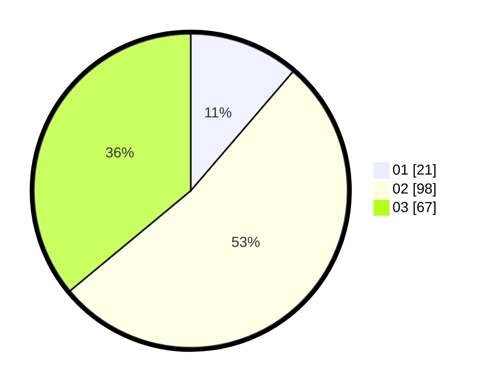

# Hasil

Hasil perolehan suara paslon dapat dilihat pada file paslon-01.txt, paslon-02.txt, dan paslon-03.txt.

Jika tidak ada, artinya data tersebut belum ada pada SIREKAP.

## Perolehan Suara

 * Paslon 01: **21**.
 * Paslon 02: **98**.
 * Paslon 03: **67**.

## Foto C Plano

https://sirekap-obj-formc.kpu.go.id/ebec/pemilu/ppwp/31/72/02/10/06/3172021006230-20240214-155057--e269b934-f48b-4f09-b12b-69aa8cd41b16.jpg

https://sirekap-obj-formc.kpu.go.id/ebec/pemilu/ppwp/31/72/02/10/06/3172021006230-20240214-155104--401ab509-917a-4aa7-a4a4-5a3b7b5393d6.jpg

https://sirekap-obj-formc.kpu.go.id/ebec/pemilu/ppwp/31/72/02/10/06/3172021006230-20240214-155123--8801e0f0-44be-4f94-8875-16594fb1d132.jpg

## DATA PEMILIH TETAP

Jumlah pemilih dalam DPT: **217**.
 * L: **99**.
 * P: **118**.

## DATA PENGGUNA HAK PILIH

Jumlah pengguna hak pilih dalam DPT: **170**.
 * L: **80**.
 * P: **90**.

Jumlah pengguna hak pilih dalam DPTb: **19**.
 * L: **5**.
 * P: **14**.

Jumlah pengguna hak pilih dalam DPK: **3**.
 * L: **1**.
 * P: **2**.

Jumlah pengguna hak pilih: **192**.
 * L: **86**.
 * P: **106**.

## JUMLAH SUARA SAH DAN TIDAK SAH

JUMLAH SELURUH SUARA SAH: **186**.

JUMLAH SUARA TIDAK SAH: **6**.

JUMLAH SELURUH SUARA SAH DAN SUARA TIDAK SAH: **192**.
