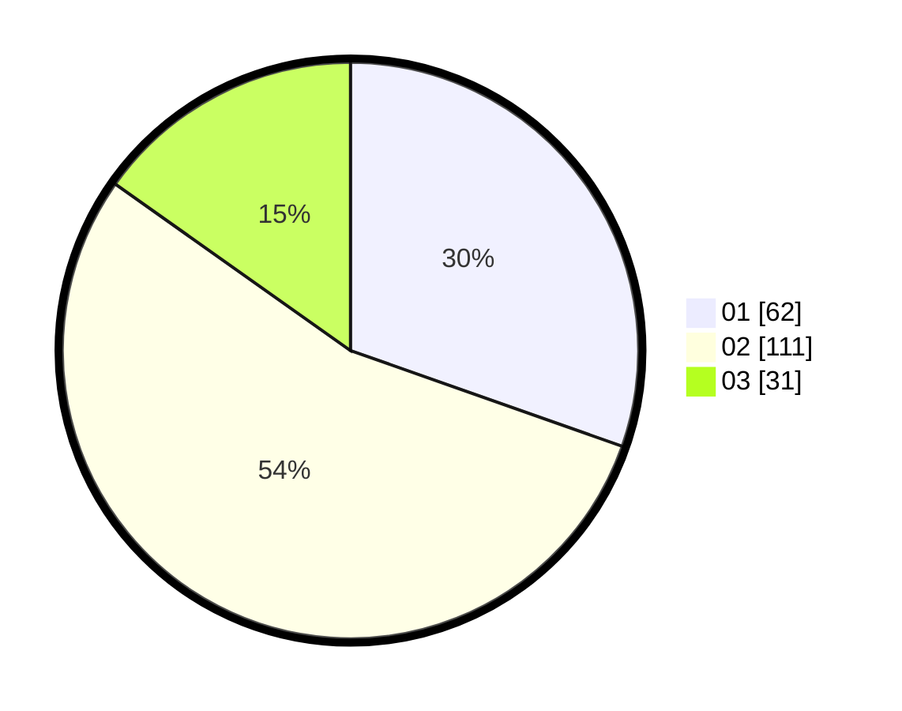

# Hasil

Hasil perolehan suara paslon dapat dilihat pada file paslon-01.txt, paslon-02.txt, dan paslon-03.txt.

Jika tidak ada, artinya data tersebut belum ada pada SIREKAP.

## Perolehan Suara

 * Paslon 01: **62**.
 * Paslon 02: **111**.
 * Paslon 03: **31**.

## Foto C Plano

https://sirekap-obj-formc.kpu.go.id/db57/pemilu/ppwp/31/72/02/10/07/3172021007001-20240216-150212--1b7450a7-2eec-4193-9830-90f6d596bafe.jpg

https://sirekap-obj-formc.kpu.go.id/db57/pemilu/ppwp/31/72/02/10/07/3172021007001-20240216-150622--9dd355ec-2d5a-491a-89f0-b5429e47eab1.jpg

https://sirekap-obj-formc.kpu.go.id/db57/pemilu/ppwp/31/72/02/10/07/3172021007001-20240216-155220--0494221e-2c6e-4e4a-850d-9ab7ebe71d92.jpg

## DATA PEMILIH TETAP

Jumlah pemilih dalam DPT: **290**.
 * L: **137**.
 * P: **153**.

## DATA PENGGUNA HAK PILIH

Jumlah pengguna hak pilih dalam DPT: **208**.
 * L: **89**.
 * P: **119**.

Jumlah pengguna hak pilih dalam DPTb: **0**.
 * L: **0**.
 * P: **0**.

Jumlah pengguna hak pilih dalam DPK: **1**.
 * L: **1**.
 * P: **0**.

Jumlah pengguna hak pilih: **209**.
 * L: **90**.
 * P: **119**.

## JUMLAH SUARA SAH DAN TIDAK SAH

JUMLAH SELURUH SUARA SAH: **204**.

JUMLAH SUARA TIDAK SAH: **5**.

JUMLAH SELURUH SUARA SAH DAN SUARA TIDAK SAH: **209**.
