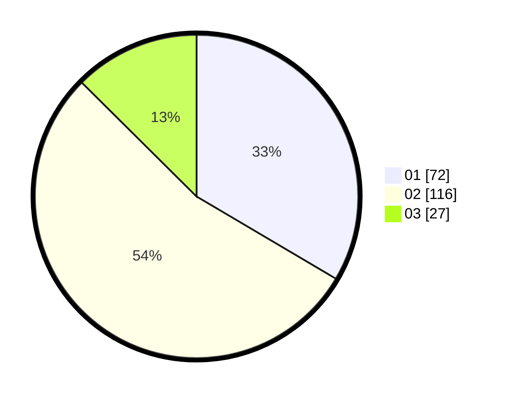

# Hasil

Hasil perolehan suara paslon dapat dilihat pada file paslon-01.txt, paslon-02.txt, dan paslon-03.txt.

Jika tidak ada, artinya data tersebut belum ada pada SIREKAP.

## Perolehan Suara

 * Paslon 01: **72**.
 * Paslon 02: **116**.
 * Paslon 03: **27**.

## Foto C Plano

https://sirekap-obj-formc.kpu.go.id/3198/pemilu/ppwp/31/72/02/10/07/3172021007002-20240216-155249--35000870-9980-4bb7-a06b-89500a5e0288.jpg

https://sirekap-obj-formc.kpu.go.id/3198/pemilu/ppwp/31/72/02/10/07/3172021007002-20240216-160138--42f29261-1317-4ad4-ac52-1c1ebd2bfad6.jpg

https://sirekap-obj-formc.kpu.go.id/3198/pemilu/ppwp/31/72/02/10/07/3172021007002-20240216-160407--c7689d3d-9c65-429c-b317-6c3a510dea3c.jpg

## DATA PEMILIH TETAP

Jumlah pemilih dalam DPT: **288**.
 * L: **137**.
 * P: **151**.

## DATA PENGGUNA HAK PILIH

Jumlah pengguna hak pilih dalam DPT: **217**.
 * L: **95**.
 * P: **122**.

Jumlah pengguna hak pilih dalam DPTb: **0**.
 * L: **0**.
 * P: **0**.

Jumlah pengguna hak pilih dalam DPK: **2**.
 * L: **1**.
 * P: **1**.

Jumlah pengguna hak pilih: **219**.
 * L: **96**.
 * P: **124**.

## JUMLAH SUARA SAH DAN TIDAK SAH

JUMLAH SELURUH SUARA SAH: **215**.

JUMLAH SUARA TIDAK SAH: **4**.

JUMLAH SELURUH SUARA SAH DAN SUARA TIDAK SAH: **219**.
