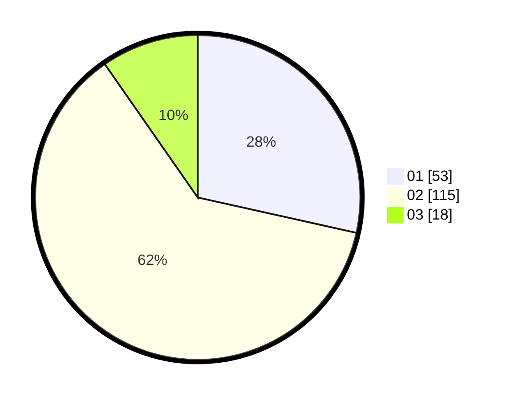

# Hasil

Hasil perolehan suara paslon dapat dilihat pada file paslon-01.txt, paslon-02.txt, dan paslon-03.txt.

Jika tidak ada, artinya data tersebut belum ada pada SIREKAP.

## Perolehan Suara

 * Paslon 01: **53**.
 * Paslon 02: **115**.
 * Paslon 03: **18**.

## Foto C Plano

https://sirekap-obj-formc.kpu.go.id/45d8/pemilu/ppwp/31/72/02/10/07/3172021007003-20240216-144134--5bded8fa-d996-475f-8411-c84aafff0d16.jpg

https://sirekap-obj-formc.kpu.go.id/45d8/pemilu/ppwp/31/72/02/10/07/3172021007003-20240216-145203--9ffaaad8-fcc0-4160-bc34-d562d1047814.jpg

https://sirekap-obj-formc.kpu.go.id/45d8/pemilu/ppwp/31/72/02/10/07/3172021007003-20240216-144441--a6870431-9988-41c4-a069-e08cde761128.jpg

## DATA PEMILIH TETAP

Jumlah pemilih dalam DPT: **290**.
 * L: **146**.
 * P: **144**.

## DATA PENGGUNA HAK PILIH

Jumlah pengguna hak pilih dalam DPT: **180**.
 * L: **86**.
 * P: **94**.

Jumlah pengguna hak pilih dalam DPTb: **2**.
 * L: **1**.
 * P: **1**.

Jumlah pengguna hak pilih dalam DPK: **8**.
 * L: **5**.
 * P: **3**.

Jumlah pengguna hak pilih: **190**.
 * L: **92**.
 * P: **98**.

## JUMLAH SUARA SAH DAN TIDAK SAH

JUMLAH SELURUH SUARA SAH: **186**.

JUMLAH SUARA TIDAK SAH: **5**.

JUMLAH SELURUH SUARA SAH DAN SUARA TIDAK SAH: **191**.
