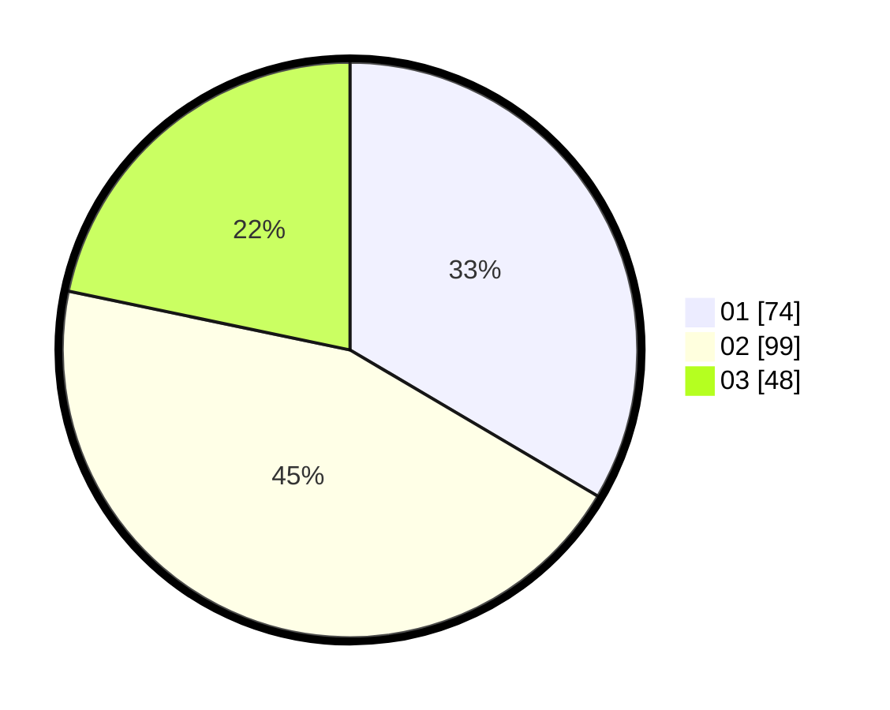

# Hasil

Hasil perolehan suara paslon dapat dilihat pada file paslon-01.txt, paslon-02.txt, dan paslon-03.txt.

Jika tidak ada, artinya data tersebut belum ada pada SIREKAP.

## Perolehan Suara

 * Paslon 01: **74**.
 * Paslon 02: **99**.
 * Paslon 03: **48**.

## Foto C Plano

https://sirekap-obj-formc.kpu.go.id/cc34/pemilu/ppwp/31/72/02/10/07/3172021007004-20240215-023255--2c623c6a-ea36-4c74-944e-bc8331ec2f0d.jpg

https://sirekap-obj-formc.kpu.go.id/cc34/pemilu/ppwp/31/72/02/10/07/3172021007004-20240215-023341--f528e4a7-067a-4be6-9f43-f89e4c2519d3.jpg

https://sirekap-obj-formc.kpu.go.id/cc34/pemilu/ppwp/31/72/02/10/07/3172021007004-20240216-144228--347d996f-613d-46ec-84d5-711c94e4d670.jpg

## DATA PEMILIH TETAP

Jumlah pemilih dalam DPT: **288**.
 * L: **137**.
 * P: **151**.

## DATA PENGGUNA HAK PILIH

Jumlah pengguna hak pilih dalam DPT: **220**.
 * L: **101**.
 * P: **119**.

Jumlah pengguna hak pilih dalam DPTb: **3**.
 * L: **2**.
 * P: **1**.

Jumlah pengguna hak pilih dalam DPK: **0**.
 * L: **0**.
 * P: **0**.

Jumlah pengguna hak pilih: **223**.
 * L: **103**.
 * P: **120**.

## JUMLAH SUARA SAH DAN TIDAK SAH

JUMLAH SELURUH SUARA SAH: **221**.

JUMLAH SUARA TIDAK SAH: **2**.

JUMLAH SELURUH SUARA SAH DAN SUARA TIDAK SAH: **223**.
