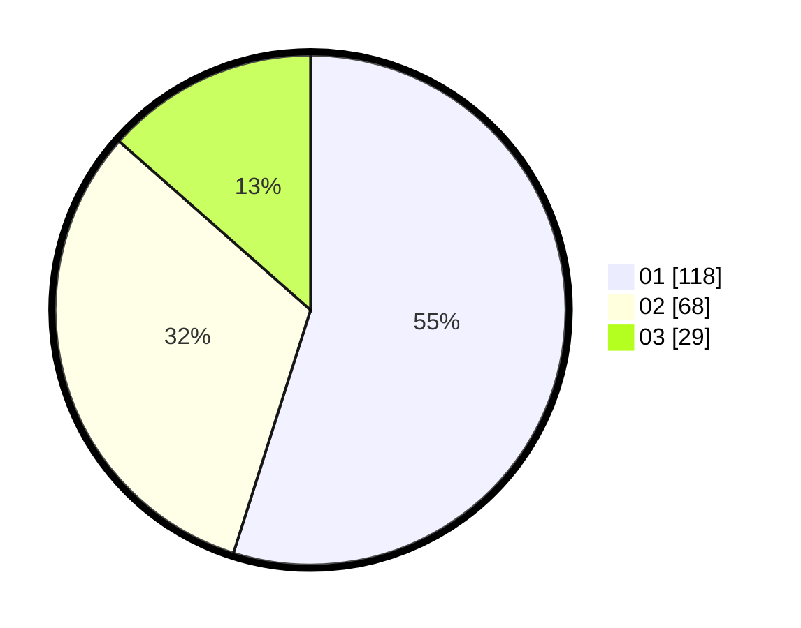

# Hasil

Hasil perolehan suara paslon dapat dilihat pada file paslon-01.txt, paslon-02.txt, dan paslon-03.txt.

Jika tidak ada, artinya data tersebut belum ada pada SIREKAP.

## Perolehan Suara

 * Paslon 01: **118**.
 * Paslon 02: **68**.
 * Paslon 03: **29**.

## Foto C Plano

https://sirekap-obj-formc.kpu.go.id/1c58/pemilu/ppwp/31/72/02/10/07/3172021007021-20240214-184930--a8cb3003-cabc-4303-8691-43e395d8c955.jpg

https://sirekap-obj-formc.kpu.go.id/1c58/pemilu/ppwp/31/72/02/10/07/3172021007021-20240214-184542--ec0aadf7-124e-4f98-859f-b20ac45594d8.jpg

https://sirekap-obj-formc.kpu.go.id/1c58/pemilu/ppwp/31/72/02/10/07/3172021007021-20240214-184556--fe17dcc2-541d-43f6-aa35-241eee1b30c9.jpg
