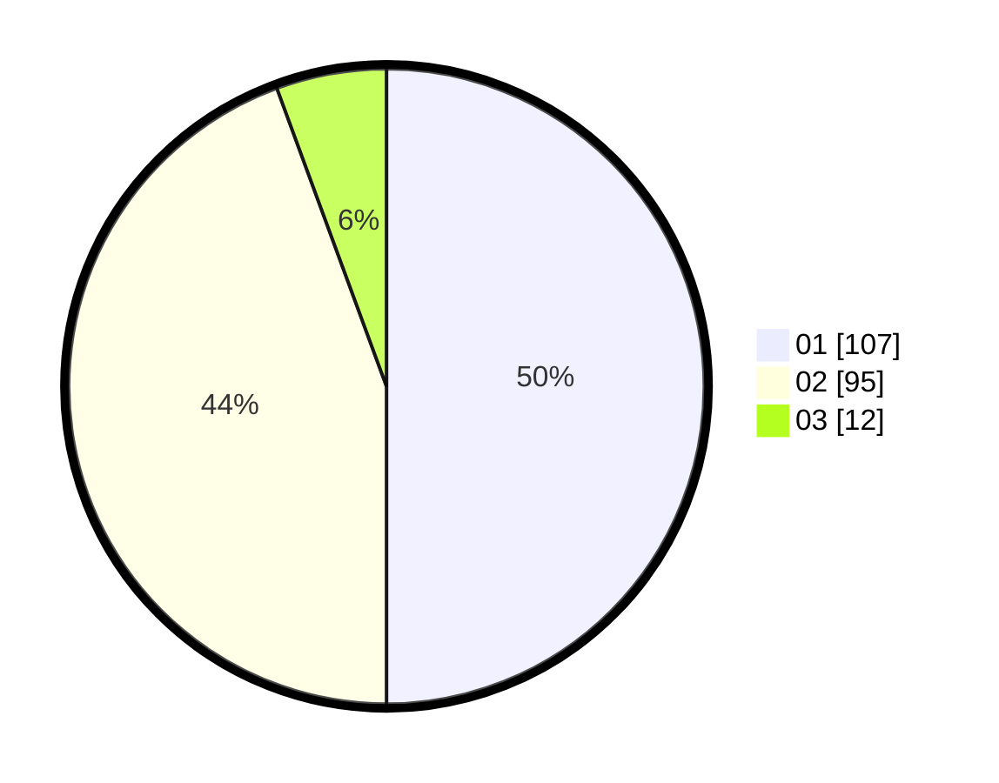

# Hasil

Hasil perolehan suara paslon dapat dilihat pada file paslon-01.txt, paslon-02.txt, dan paslon-03.txt.

Jika tidak ada, artinya data tersebut belum ada pada SIREKAP.

## Perolehan Suara

 * Paslon 01: **107**.
 * Paslon 02: **95**.
 * Paslon 03: **12**.

## Foto C Plano

https://sirekap-obj-formc.kpu.go.id/8f5e/pemilu/ppwp/31/72/02/10/07/3172021007024-20240214-213322--3fcc5da5-5be6-4684-b303-94c3d269e6e2.jpg

https://sirekap-obj-formc.kpu.go.id/8f5e/pemilu/ppwp/31/72/02/10/07/3172021007024-20240214-212812--f6c09bc3-78b5-4cac-9ca1-cc1b513f66a1.jpg

https://sirekap-obj-formc.kpu.go.id/8f5e/pemilu/ppwp/31/72/02/10/07/3172021007024-20240214-213203--437f80b2-9f91-41f3-a1cb-4aed43966339.jpg

## DATA PEMILIH TETAP

Jumlah pemilih dalam DPT: **291**.
 * L: **135**.
 * P: **156**.

## DATA PENGGUNA HAK PILIH

Jumlah pengguna hak pilih dalam DPT: **211**.
 * L: **92**.
 * P: **119**.

Jumlah pengguna hak pilih dalam DPTb: **2**.
 * L: **1**.
 * P: **1**.

Jumlah pengguna hak pilih dalam DPK: **3**.
 * L: **2**.
 * P: **1**.

Jumlah pengguna hak pilih: **216**.
 * L: **95**.
 * P: **121**.

## JUMLAH SUARA SAH DAN TIDAK SAH

JUMLAH SELURUH SUARA SAH: **214**.

JUMLAH SUARA TIDAK SAH: **2**.

JUMLAH SELURUH SUARA SAH DAN SUARA TIDAK SAH: **216**.
