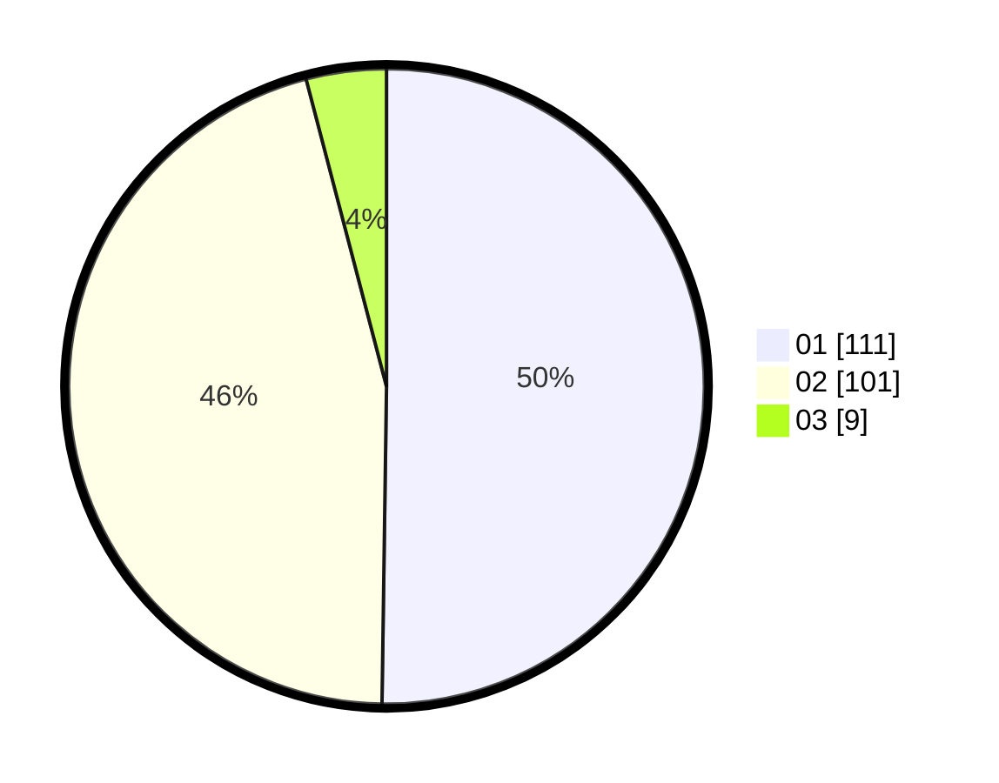

# Hasil

Hasil perolehan suara paslon dapat dilihat pada file paslon-01.txt, paslon-02.txt, dan paslon-03.txt.

Jika tidak ada, artinya data tersebut belum ada pada SIREKAP.

## Perolehan Suara

 * Paslon 01: **111**.
 * Paslon 02: **101**.
 * Paslon 03: **9**.

## Foto C Plano

https://sirekap-obj-formc.kpu.go.id/a323/pemilu/ppwp/31/72/02/10/07/3172021007025-20240215-010054--d37ca87b-f41b-4c3f-8008-91ceff5aa1af.jpg

https://sirekap-obj-formc.kpu.go.id/a323/pemilu/ppwp/31/72/02/10/07/3172021007025-20240215-010218--959d1aaa-da75-427d-9e4a-fd95f171c7d0.jpg

https://sirekap-obj-formc.kpu.go.id/a323/pemilu/ppwp/31/72/02/10/07/3172021007025-20240215-010306--6155ed3e-fb65-455c-b239-9f09fcb6ffa0.jpg
