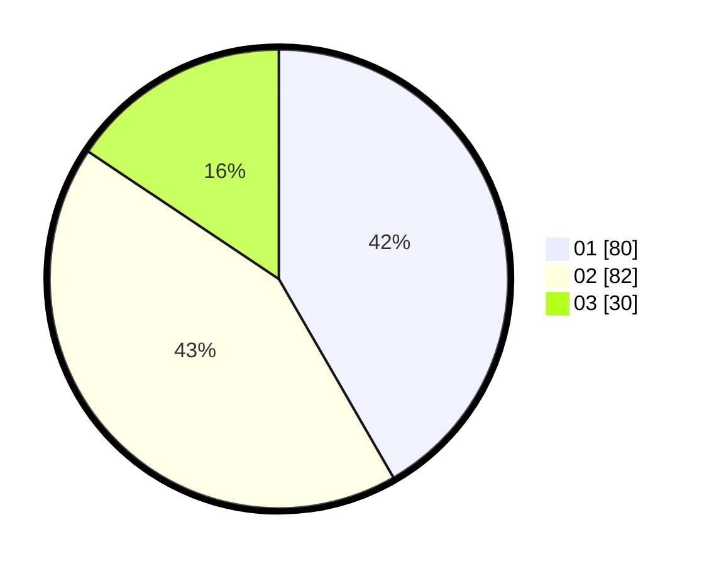

# Hasil

Hasil perolehan suara paslon dapat dilihat pada file paslon-01.txt, paslon-02.txt, dan paslon-03.txt.

Jika tidak ada, artinya data tersebut belum ada pada SIREKAP.

## Perolehan Suara

 * Paslon 01: **80**.
 * Paslon 02: **82**.
 * Paslon 03: **30**.

## Foto C Plano

https://sirekap-obj-formc.kpu.go.id/f7eb/pemilu/ppwp/31/72/02/10/07/3172021007049-20240216-165648--0f52107b-f321-45e5-ad6b-4f5219f33eec.jpg

https://sirekap-obj-formc.kpu.go.id/f7eb/pemilu/ppwp/31/72/02/10/07/3172021007049-20240216-171009--a2c9a3fc-bd54-4efd-8c9d-ca4e4e5f6a5a.jpg

https://sirekap-obj-formc.kpu.go.id/f7eb/pemilu/ppwp/31/72/02/10/07/3172021007049-20240216-171254--75f1ebc6-a0f5-455f-a2e9-1de796185b2a.jpg

## DATA PEMILIH TETAP

Jumlah pemilih dalam DPT: **192**.
 * L: **94**.
 * P: **98**.

## DATA PENGGUNA HAK PILIH

Jumlah pengguna hak pilih dalam DPT: **192**.
 * L: **94**.
 * P: **98**.

Jumlah pengguna hak pilih dalam DPTb: **1**.
 * L: **1**.
 * P: **0**.

Jumlah pengguna hak pilih dalam DPK: **0**.
 * L: **0**.
 * P: **0**.

Jumlah pengguna hak pilih: **193**.
 * L: **95**.
 * P: **98**.

## JUMLAH SUARA SAH DAN TIDAK SAH

JUMLAH SELURUH SUARA SAH: **192**.

JUMLAH SUARA TIDAK SAH: **1**.

JUMLAH SELURUH SUARA SAH DAN SUARA TIDAK SAH: **193**.
