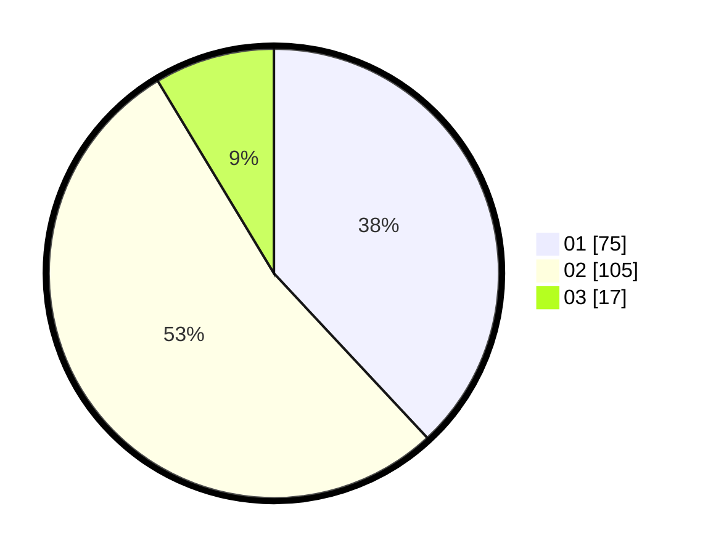

# Hasil

Hasil perolehan suara paslon dapat dilihat pada file paslon-01.txt, paslon-02.txt, dan paslon-03.txt.

Jika tidak ada, artinya data tersebut belum ada pada SIREKAP.

## Perolehan Suara

 * Paslon 01: **75**.
 * Paslon 02: **105**.
 * Paslon 03: **17**.

## Foto C Plano

https://sirekap-obj-formc.kpu.go.id/1454/pemilu/ppwp/31/72/02/10/07/3172021007107-20240214-194308--db389ed3-b1b1-408f-aca6-44eb6e32ab89.jpg

https://sirekap-obj-formc.kpu.go.id/1454/pemilu/ppwp/31/72/02/10/07/3172021007107-20240214-195451--d7245243-a764-4b31-8a39-7c8dfc47f3e4.jpg

https://sirekap-obj-formc.kpu.go.id/1454/pemilu/ppwp/31/72/02/10/07/3172021007107-20240214-200501--6e9fc196-9d23-43c9-955c-2737ea129f9f.jpg
