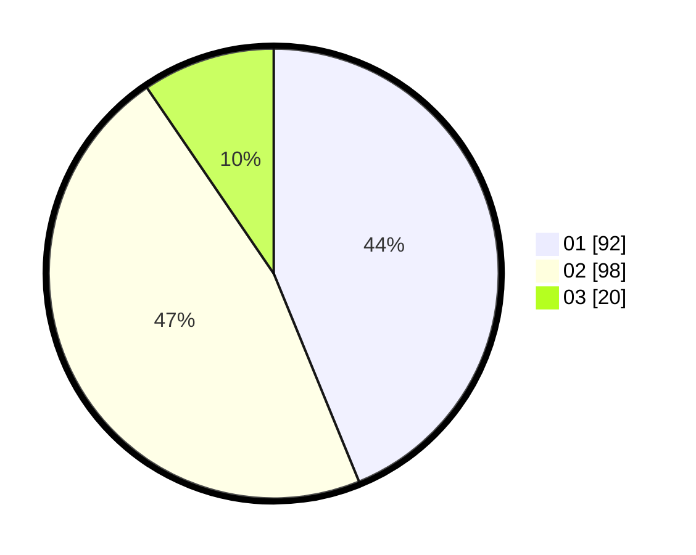

# Hasil

Hasil perolehan suara paslon dapat dilihat pada file paslon-01.txt, paslon-02.txt, dan paslon-03.txt.

Jika tidak ada, artinya data tersebut belum ada pada SIREKAP.

## Perolehan Suara

 * Paslon 01: **92**.
 * Paslon 02: **98**.
 * Paslon 03: **20**.

## Foto C Plano

https://sirekap-obj-formc.kpu.go.id/2008/pemilu/ppwp/31/72/02/10/07/3172021007113-20240214-234217--5921b129-4d8c-47cc-8139-e6dbe916739b.jpg

https://sirekap-obj-formc.kpu.go.id/2008/pemilu/ppwp/31/72/02/10/07/3172021007113-20240214-234304--93fbe98b-20d8-4240-82e5-7bbd45cd6e5e.jpg

https://sirekap-obj-formc.kpu.go.id/2008/pemilu/ppwp/31/72/02/10/07/3172021007113-20240214-234359--5320d593-d1a7-4116-85e2-52c80ed8992a.jpg

## DATA PEMILIH TETAP

Jumlah pemilih dalam DPT: **295**.
 * L: **146**.
 * P: **149**.

## DATA PENGGUNA HAK PILIH

Jumlah pengguna hak pilih dalam DPT: **213**.
 * L: **100**.
 * P: **113**.

Jumlah pengguna hak pilih dalam DPTb: **1**.
 * L: **1**.
 * P: **0**.

Jumlah pengguna hak pilih dalam DPK: **0**.
 * L: **0**.
 * P: **0**.

Jumlah pengguna hak pilih: **214**.
 * L: **101**.
 * P: **113**.

## JUMLAH SUARA SAH DAN TIDAK SAH

JUMLAH SELURUH SUARA SAH: **214**.

JUMLAH SUARA TIDAK SAH: **4**.

JUMLAH SELURUH SUARA SAH DAN SUARA TIDAK SAH: **218**.
