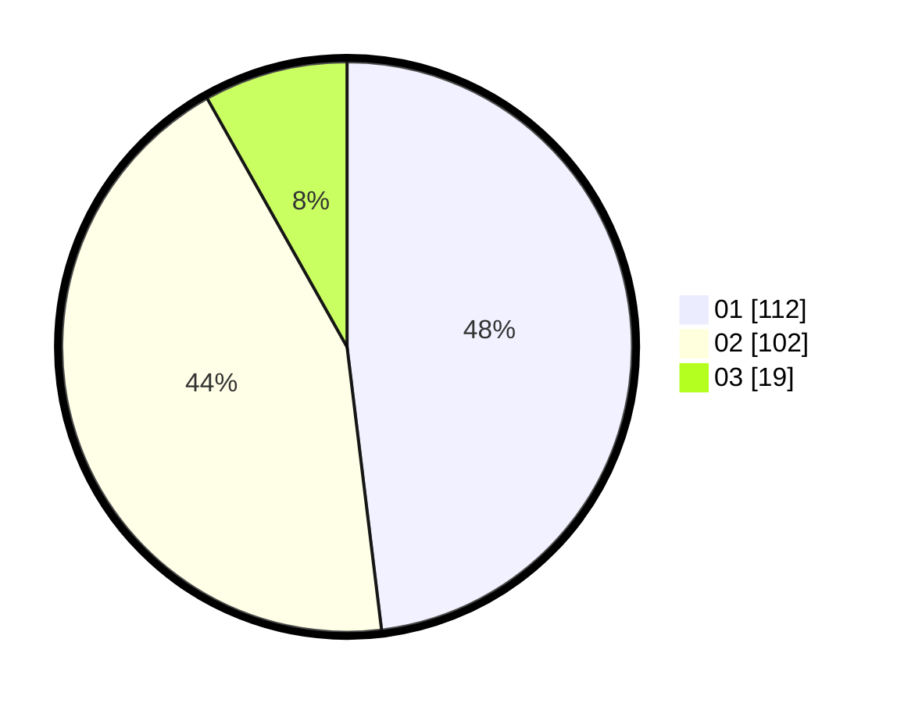

# Hasil

Hasil perolehan suara paslon dapat dilihat pada file paslon-01.txt, paslon-02.txt, dan paslon-03.txt.

Jika tidak ada, artinya data tersebut belum ada pada SIREKAP.

## Perolehan Suara

 * Paslon 01: **112**.
 * Paslon 02: **102**.
 * Paslon 03: **19**.

## Foto C Plano

https://sirekap-obj-formc.kpu.go.id/4120/pemilu/ppwp/31/72/02/10/07/3172021007128-20240214-185846--66bd35c6-2907-4769-800d-fd211cbae0ed.jpg

https://sirekap-obj-formc.kpu.go.id/4120/pemilu/ppwp/31/72/02/10/07/3172021007128-20240214-185929--e76c010e-2e17-4a00-9f10-c4501773a563.jpg

https://sirekap-obj-formc.kpu.go.id/4120/pemilu/ppwp/31/72/02/10/07/3172021007128-20240214-190049--2958b349-261f-48d4-9b0c-23f90fb34200.jpg

## DATA PEMILIH TETAP

Jumlah pemilih dalam DPT: **291**.
 * L: **151**.
 * P: **140**.

## DATA PENGGUNA HAK PILIH

Jumlah pengguna hak pilih dalam DPT: **234**.
 * L: **113**.
 * P: **121**.

Jumlah pengguna hak pilih dalam DPTb: **0**.
 * L: **0**.
 * P: **0**.

Jumlah pengguna hak pilih dalam DPK: **3**.
 * L: **2**.
 * P: **1**.

Jumlah pengguna hak pilih: **237**.
 * L: **115**.
 * P: **122**.

## JUMLAH SUARA SAH DAN TIDAK SAH

JUMLAH SELURUH SUARA SAH: **233**.

JUMLAH SUARA TIDAK SAH: **4**.

JUMLAH SELURUH SUARA SAH DAN SUARA TIDAK SAH: **237**.
