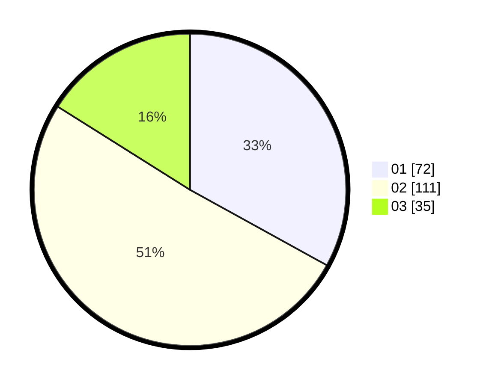

# Hasil

Hasil perolehan suara paslon dapat dilihat pada file paslon-01.txt, paslon-02.txt, dan paslon-03.txt.

Jika tidak ada, artinya data tersebut belum ada pada SIREKAP.

## Perolehan Suara

 * Paslon 01: **72**.
 * Paslon 02: **111**.
 * Paslon 03: **35**.

## Foto C Plano

https://sirekap-obj-formc.kpu.go.id/291f/pemilu/ppwp/31/72/02/10/07/3172021007143-20240215-014007--ac8b02a8-330e-4da6-b931-7191a63990af.jpg

https://sirekap-obj-formc.kpu.go.id/291f/pemilu/ppwp/31/72/02/10/07/3172021007143-20240215-014042--6077e5b8-9acb-4f96-88fb-614330099dfd.jpg

https://sirekap-obj-formc.kpu.go.id/291f/pemilu/ppwp/31/72/02/10/07/3172021007143-20240215-014114--41b1f062-d9c9-4b0b-b6c8-c4f6f5375f6d.jpg

## DATA PEMILIH TETAP

Jumlah pemilih dalam DPT: **278**.
 * L: **136**.
 * P: **142**.

## DATA PENGGUNA HAK PILIH

Jumlah pengguna hak pilih dalam DPT: **211**.
 * L: **96**.
 * P: **115**.

Jumlah pengguna hak pilih dalam DPTb: **9**.
 * L: **6**.
 * P: **3**.

Jumlah pengguna hak pilih dalam DPK: **3**.
 * L: **1**.
 * P: **2**.

Jumlah pengguna hak pilih: **223**.
 * L: **103**.
 * P: **120**.

## JUMLAH SUARA SAH DAN TIDAK SAH

JUMLAH SELURUH SUARA SAH: **218**.

JUMLAH SUARA TIDAK SAH: **5**.

JUMLAH SELURUH SUARA SAH DAN SUARA TIDAK SAH: **223**.
