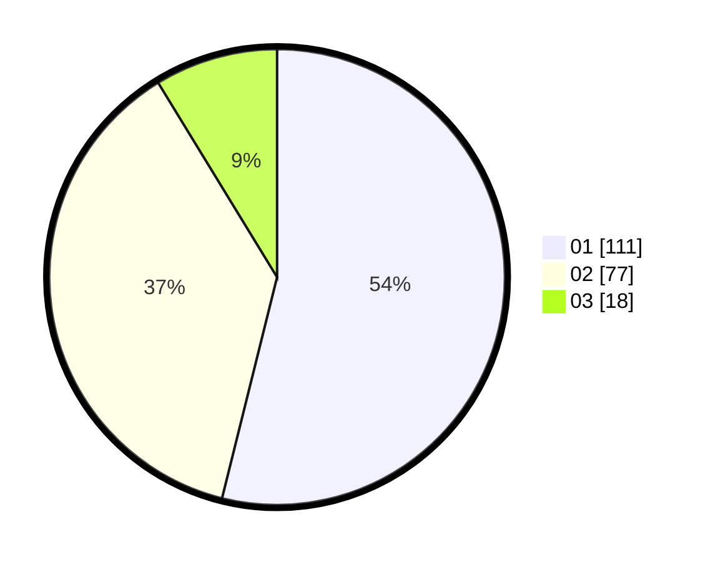

# Hasil

Hasil perolehan suara paslon dapat dilihat pada file paslon-01.txt, paslon-02.txt, dan paslon-03.txt.

Jika tidak ada, artinya data tersebut belum ada pada SIREKAP.

## Perolehan Suara

 * Paslon 01: **111**.
 * Paslon 02: **77**.
 * Paslon 03: **18**.

## Foto C Plano

https://sirekap-obj-formc.kpu.go.id/8f8d/pemilu/ppwp/31/72/03/10/01/3172031001003-20240214-184615--aed8e75c-1f1a-4d69-a3b4-91ffbc9c18bd.jpg

https://sirekap-obj-formc.kpu.go.id/8f8d/pemilu/ppwp/31/72/03/10/01/3172031001003-20240214-190351--b20b3764-2c20-40d4-a974-3930ce8a14a4.jpg

https://sirekap-obj-formc.kpu.go.id/8f8d/pemilu/ppwp/31/72/03/10/01/3172031001003-20240214-190644--baa17c3c-8540-46a1-8c05-edee4c13da0b.jpg

## DATA PEMILIH TETAP

Jumlah pemilih dalam DPT: **290**.
 * L: **141**.
 * P: **149**.

## DATA PENGGUNA HAK PILIH

Jumlah pengguna hak pilih dalam DPT: **207**.
 * L: **87**.
 * P: **120**.

Jumlah pengguna hak pilih dalam DPTb: **0**.
 * L: **0**.
 * P: **0**.

Jumlah pengguna hak pilih dalam DPK: **2**.
 * L: **0**.
 * P: **2**.

Jumlah pengguna hak pilih: **209**.
 * L: **87**.
 * P: **122**.

## JUMLAH SUARA SAH DAN TIDAK SAH

JUMLAH SELURUH SUARA SAH: **206**.

JUMLAH SUARA TIDAK SAH: **3**.

JUMLAH SELURUH SUARA SAH DAN SUARA TIDAK SAH: **209**.
