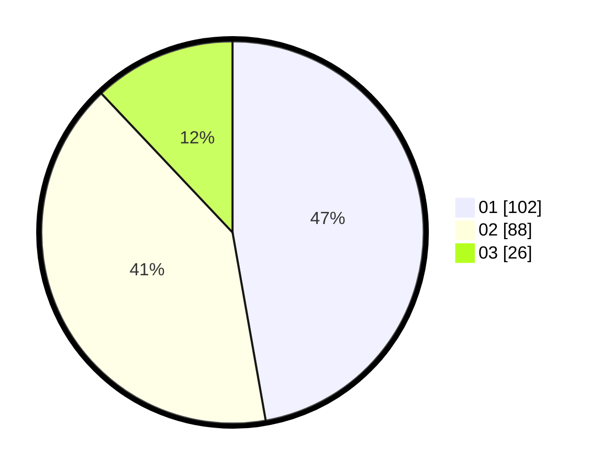

# Hasil

Hasil perolehan suara paslon dapat dilihat pada file paslon-01.txt, paslon-02.txt, dan paslon-03.txt.

Jika tidak ada, artinya data tersebut belum ada pada SIREKAP.

## Perolehan Suara

 * Paslon 01: **102**.
 * Paslon 02: **88**.
 * Paslon 03: **26**.

## Foto C Plano

https://sirekap-obj-formc.kpu.go.id/8a4d/pemilu/ppwp/31/72/03/10/01/3172031001007-20240214-184823--97da300f-fb8b-464d-bc1f-e53d99eae7ed.jpg

https://sirekap-obj-formc.kpu.go.id/8a4d/pemilu/ppwp/31/72/03/10/01/3172031001007-20240214-185525--3ff8fbbd-3825-438c-9989-be05769634d0.jpg

https://sirekap-obj-formc.kpu.go.id/8a4d/pemilu/ppwp/31/72/03/10/01/3172031001007-20240214-185406--5e0dcdc5-5781-4a2c-a218-f2484e012317.jpg
