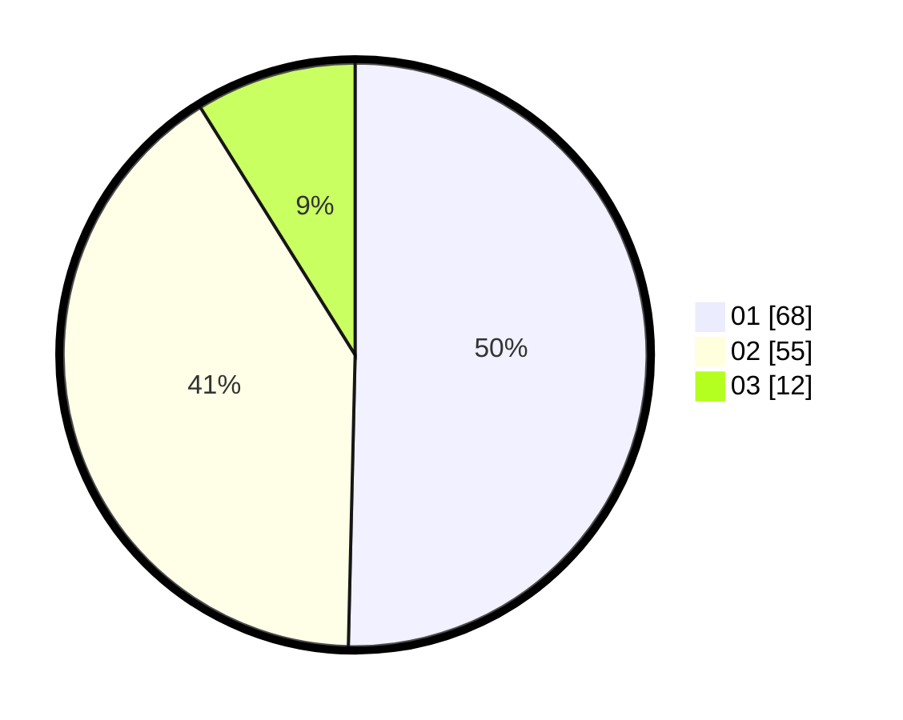

# Hasil

Hasil perolehan suara paslon dapat dilihat pada file paslon-01.txt, paslon-02.txt, dan paslon-03.txt.

Jika tidak ada, artinya data tersebut belum ada pada SIREKAP.

## Perolehan Suara

 * Paslon 01: **68**.
 * Paslon 02: **55**.
 * Paslon 03: **12**.

## Foto C Plano

https://sirekap-obj-formc.kpu.go.id/9be9/pemilu/ppwp/31/72/03/10/01/3172031001008-20240214-194117--790e3726-28f8-4cce-80b6-07f4751a0236.jpg

https://sirekap-obj-formc.kpu.go.id/9be9/pemilu/ppwp/31/72/03/10/01/3172031001008-20240214-211722--6d3f90d7-6633-42e4-a42b-9b754446c55c.jpg

https://sirekap-obj-formc.kpu.go.id/9be9/pemilu/ppwp/31/72/03/10/01/3172031001008-20240214-192325--970f45e2-2cc9-4ec0-8d5b-6473a5b2fd94.jpg

## DATA PEMILIH TETAP

Jumlah pemilih dalam DPT: **198**.
 * L: **105**.
 * P: **93**.

## DATA PENGGUNA HAK PILIH

Jumlah pengguna hak pilih dalam DPT: **136**.
 * L: **62**.
 * P: **74**.

Jumlah pengguna hak pilih dalam DPTb: **1**.
 * L: **1**.
 * P: **0**.

Jumlah pengguna hak pilih dalam DPK: **0**.
 * L: **0**.
 * P: **0**.

Jumlah pengguna hak pilih: **137**.
 * L: **63**.
 * P: **74**.

## JUMLAH SUARA SAH DAN TIDAK SAH

JUMLAH SELURUH SUARA SAH: **135**.

JUMLAH SUARA TIDAK SAH: **2**.

JUMLAH SELURUH SUARA SAH DAN SUARA TIDAK SAH: **137**.
