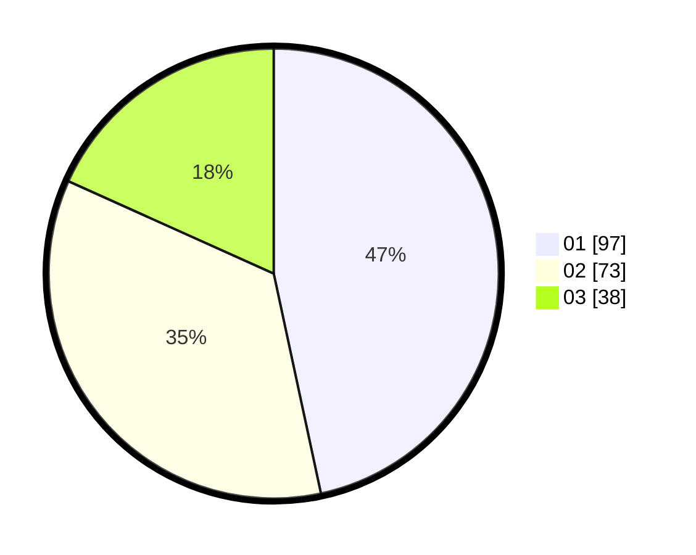

# Hasil

Hasil perolehan suara paslon dapat dilihat pada file paslon-01.txt, paslon-02.txt, dan paslon-03.txt.

Jika tidak ada, artinya data tersebut belum ada pada SIREKAP.

## Perolehan Suara

 * Paslon 01: **97**.
 * Paslon 02: **73**.
 * Paslon 03: **38**.

## Foto C Plano

https://sirekap-obj-formc.kpu.go.id/9939/pemilu/ppwp/31/72/03/10/01/3172031001009-20240214-192012--52ca9856-133a-4443-bcb6-aca33d6c5c17.jpg

https://sirekap-obj-formc.kpu.go.id/9939/pemilu/ppwp/31/72/03/10/01/3172031001009-20240214-191205--cfdc4c66-1c6e-4b28-a8cf-758ddfda7a43.jpg

https://sirekap-obj-formc.kpu.go.id/9939/pemilu/ppwp/31/72/03/10/01/3172031001009-20240214-191223--fe26aae2-a9a6-4d0b-a5e4-0e8c327cd4fe.jpg

## DATA PEMILIH TETAP

Jumlah pemilih dalam DPT: **276**.
 * L: **141**.
 * P: **135**.

## DATA PENGGUNA HAK PILIH

Jumlah pengguna hak pilih dalam DPT: **209**.
 * L: **103**.
 * P: **106**.

Jumlah pengguna hak pilih dalam DPTb: **1**.
 * L: **0**.
 * P: **1**.

Jumlah pengguna hak pilih dalam DPK: **0**.
 * L: **0**.
 * P: **0**.

Jumlah pengguna hak pilih: **210**.
 * L: **103**.
 * P: **107**.

## JUMLAH SUARA SAH DAN TIDAK SAH

JUMLAH SELURUH SUARA SAH: **208**.

JUMLAH SUARA TIDAK SAH: **2**.

JUMLAH SELURUH SUARA SAH DAN SUARA TIDAK SAH: **210**.
