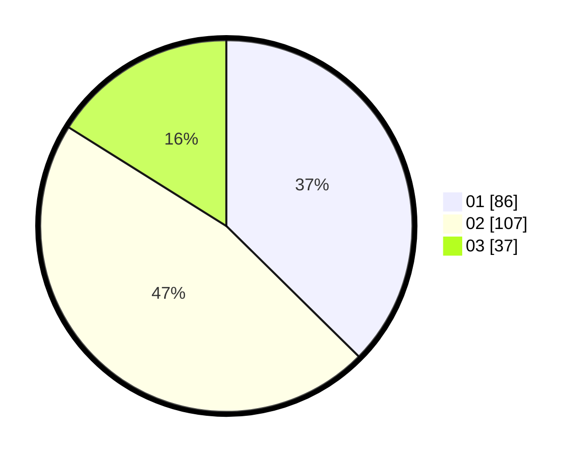

# Hasil

Hasil perolehan suara paslon dapat dilihat pada file paslon-01.txt, paslon-02.txt, dan paslon-03.txt.

Jika tidak ada, artinya data tersebut belum ada pada SIREKAP.

## Perolehan Suara

 * Paslon 01: **86**.
 * Paslon 02: **107**.
 * Paslon 03: **37**.

## Foto C Plano

https://sirekap-obj-formc.kpu.go.id/1b8b/pemilu/ppwp/31/72/03/10/01/3172031001011-20240214-205947--9491b049-121d-4c51-b211-3dbe6352d92d.jpg

https://sirekap-obj-formc.kpu.go.id/1b8b/pemilu/ppwp/31/72/03/10/01/3172031001011-20240214-221848--df45d682-916a-48ee-b1e1-3d1d715f17d6.jpg
