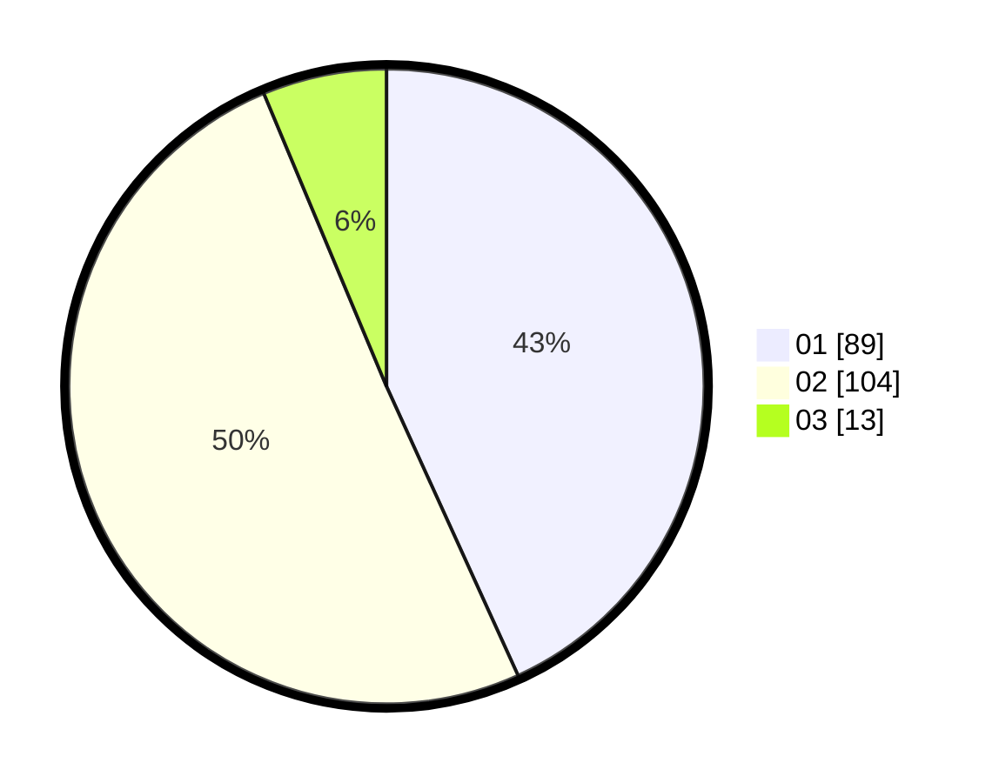

# Hasil

Hasil perolehan suara paslon dapat dilihat pada file paslon-01.txt, paslon-02.txt, dan paslon-03.txt.

Jika tidak ada, artinya data tersebut belum ada pada SIREKAP.

## Perolehan Suara

 * Paslon 01: **89**.
 * Paslon 02: **104**.
 * Paslon 03: **13**.

## Foto C Plano

https://sirekap-obj-formc.kpu.go.id/bc97/pemilu/ppwp/31/72/03/10/01/3172031001023-20240214-192833--30efe7f7-1b32-4804-8d16-8af23188b97c.jpg

https://sirekap-obj-formc.kpu.go.id/bc97/pemilu/ppwp/31/72/03/10/01/3172031001023-20240214-192857--0dce439a-b23b-42e3-98e6-8be2d6f1772b.jpg

https://sirekap-obj-formc.kpu.go.id/bc97/pemilu/ppwp/31/72/03/10/01/3172031001023-20240214-192907--6b1eab00-8544-4cad-8902-dd7524b79a66.jpg

## DATA PEMILIH TETAP

Jumlah pemilih dalam DPT: **286**.
 * L: **157**.
 * P: **129**.

## DATA PENGGUNA HAK PILIH

Jumlah pengguna hak pilih dalam DPT: **209**.
 * L: **110**.
 * P: **99**.

Jumlah pengguna hak pilih dalam DPTb: **0**.
 * L: **0**.
 * P: **0**.

Jumlah pengguna hak pilih dalam DPK: **0**.
 * L: **0**.
 * P: **0**.

Jumlah pengguna hak pilih: **209**.
 * L: **110**.
 * P: **99**.

## JUMLAH SUARA SAH DAN TIDAK SAH

JUMLAH SELURUH SUARA SAH: **206**.

JUMLAH SUARA TIDAK SAH: **3**.

JUMLAH SELURUH SUARA SAH DAN SUARA TIDAK SAH: **209**.
