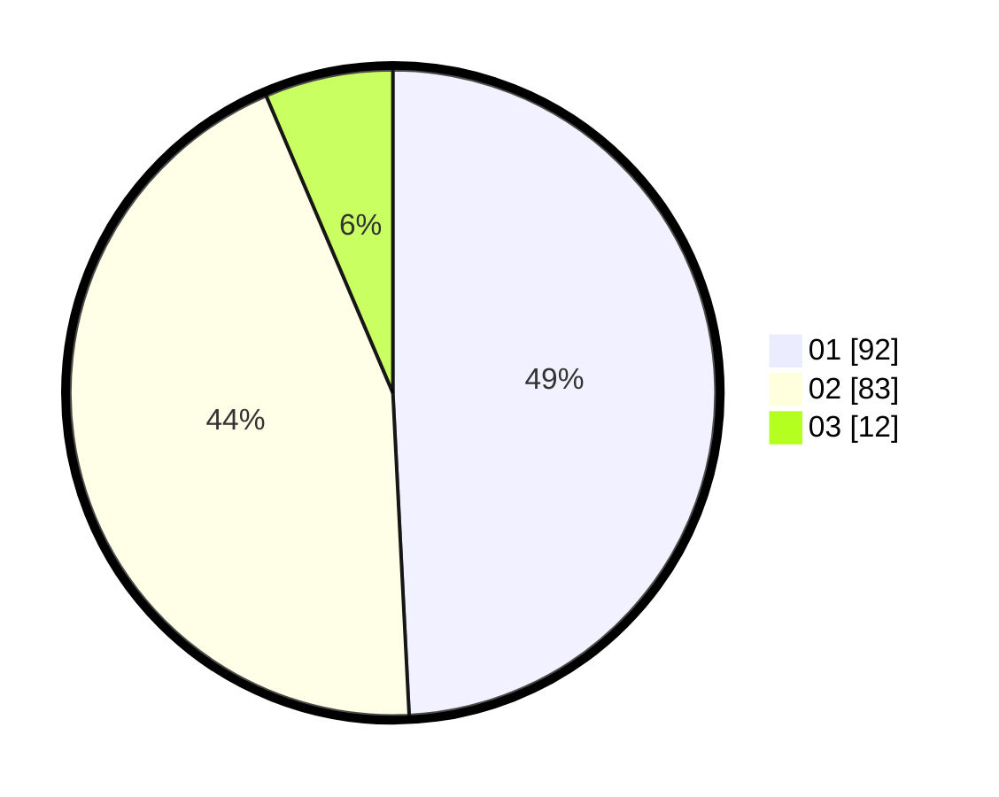

# Hasil

Hasil perolehan suara paslon dapat dilihat pada file paslon-01.txt, paslon-02.txt, dan paslon-03.txt.

Jika tidak ada, artinya data tersebut belum ada pada SIREKAP.

## Perolehan Suara

 * Paslon 01: **92**.
 * Paslon 02: **83**.
 * Paslon 03: **12**.

## Foto C Plano

https://sirekap-obj-formc.kpu.go.id/7567/pemilu/ppwp/31/72/03/10/01/3172031001025-20240214-192521--6782316b-659d-4444-8202-cf1ee8a17b1c.jpg

https://sirekap-obj-formc.kpu.go.id/7567/pemilu/ppwp/31/72/03/10/01/3172031001025-20240214-192734--9fbe82f0-5464-47d8-be54-cd18f2e97306.jpg

https://sirekap-obj-formc.kpu.go.id/7567/pemilu/ppwp/31/72/03/10/01/3172031001025-20240214-192834--d50346de-ea8c-4260-b6d4-b242abaf3a1f.jpg

## DATA PEMILIH TETAP

Jumlah pemilih dalam DPT: **285**.
 * L: **159**.
 * P: **126**.

## DATA PENGGUNA HAK PILIH

Jumlah pengguna hak pilih dalam DPT: **189**.
 * L: **95**.
 * P: **94**.

Jumlah pengguna hak pilih dalam DPTb: **2**.
 * L: **2**.
 * P: **0**.

Jumlah pengguna hak pilih dalam DPK: **1**.
 * L: **1**.
 * P: **0**.

Jumlah pengguna hak pilih: **192**.
 * L: **98**.
 * P: **94**.

## JUMLAH SUARA SAH DAN TIDAK SAH

JUMLAH SELURUH SUARA SAH: **187**.

JUMLAH SUARA TIDAK SAH: **5**.

JUMLAH SELURUH SUARA SAH DAN SUARA TIDAK SAH: **192**.
