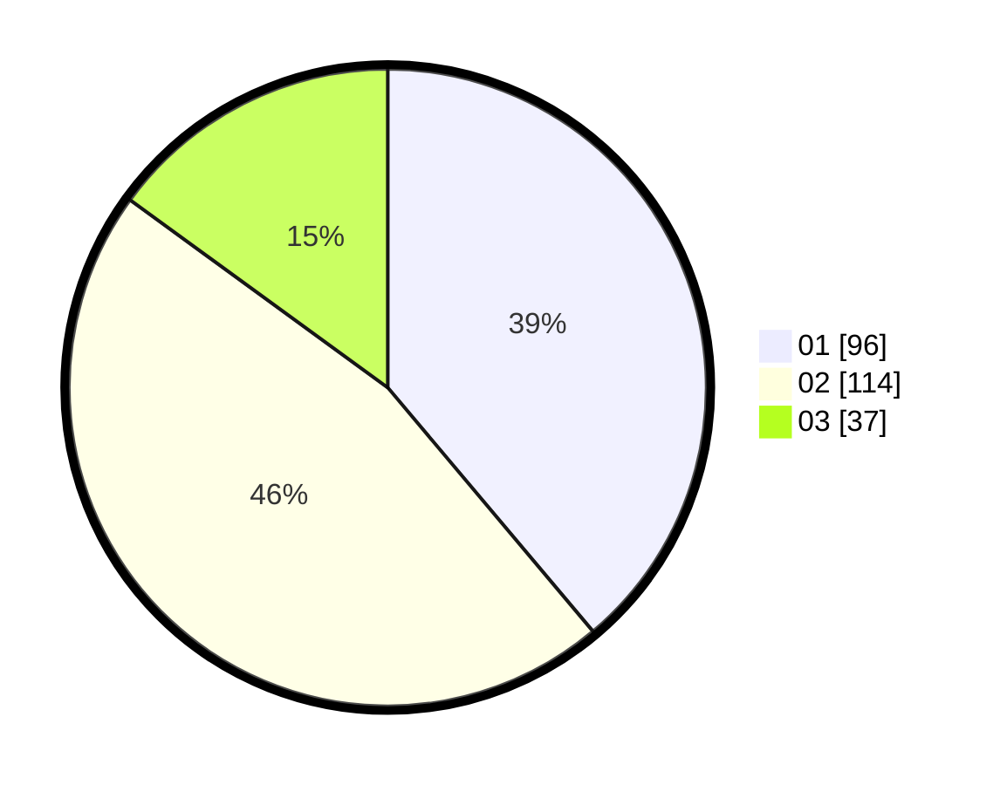

# Hasil

Hasil perolehan suara paslon dapat dilihat pada file paslon-01.txt, paslon-02.txt, dan paslon-03.txt.

Jika tidak ada, artinya data tersebut belum ada pada SIREKAP.

## Perolehan Suara

 * Paslon 01: **96**.
 * Paslon 02: **114**.
 * Paslon 03: **37**.

## Foto C Plano

https://sirekap-obj-formc.kpu.go.id/28e1/pemilu/ppwp/31/72/03/10/01/3172031001033-20240214-192205--b8ecfe3d-dfc1-4042-9f9d-347e84aa7646.jpg

https://sirekap-obj-formc.kpu.go.id/28e1/pemilu/ppwp/31/72/03/10/01/3172031001033-20240214-192405--fa71339f-34b8-4153-986d-4bc91027a2da.jpg

https://sirekap-obj-formc.kpu.go.id/28e1/pemilu/ppwp/31/72/03/10/01/3172031001033-20240214-192454--11a84219-31f4-4670-aa63-f9912e5ffeb5.jpg

## DATA PEMILIH TETAP

Jumlah pemilih dalam DPT: **289**.
 * L: **141**.
 * P: **148**.

## DATA PENGGUNA HAK PILIH

Jumlah pengguna hak pilih dalam DPT: **248**.
 * L: **117**.
 * P: **131**.

Jumlah pengguna hak pilih dalam DPTb: **1**.
 * L: **1**.
 * P: **0**.

Jumlah pengguna hak pilih dalam DPK: **0**.
 * L: **0**.
 * P: **0**.

Jumlah pengguna hak pilih: **249**.
 * L: **118**.
 * P: **131**.

## JUMLAH SUARA SAH DAN TIDAK SAH

JUMLAH SELURUH SUARA SAH: **247**.

JUMLAH SUARA TIDAK SAH: **2**.

JUMLAH SELURUH SUARA SAH DAN SUARA TIDAK SAH: **249**.
