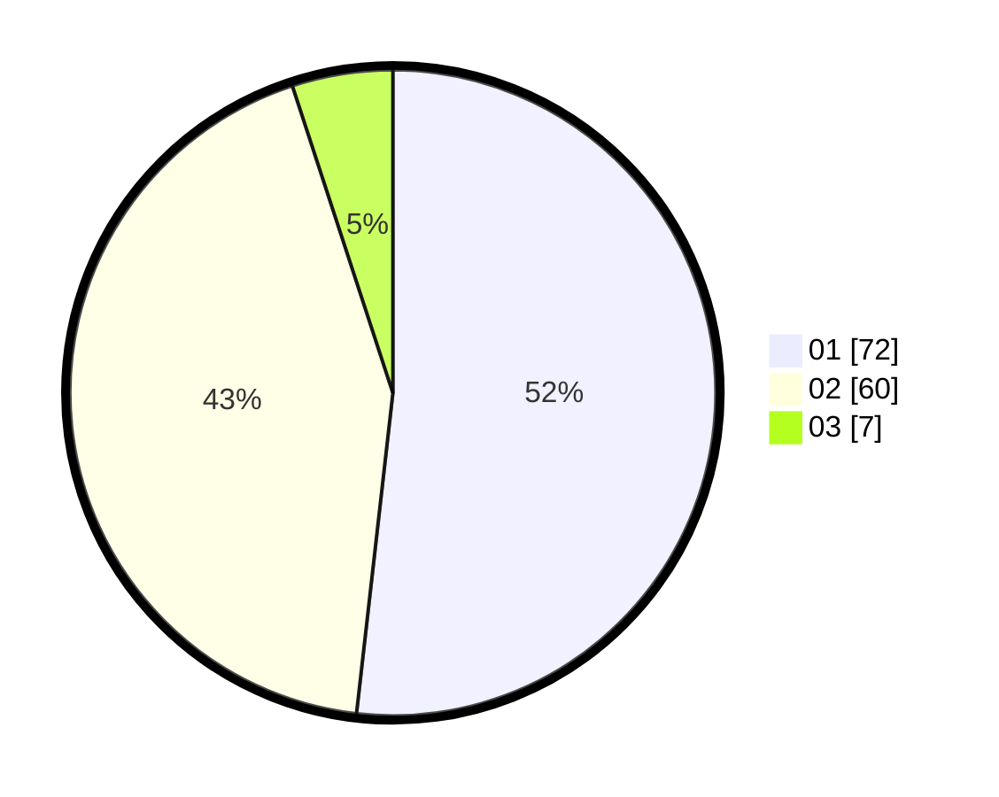

# Hasil

Hasil perolehan suara paslon dapat dilihat pada file paslon-01.txt, paslon-02.txt, dan paslon-03.txt.

Jika tidak ada, artinya data tersebut belum ada pada SIREKAP.

## Perolehan Suara

 * Paslon 01: **72**.
 * Paslon 02: **60**.
 * Paslon 03: **7**.

## Foto C Plano

https://sirekap-obj-formc.kpu.go.id/ff23/pemilu/ppwp/31/72/03/10/01/3172031001051-20240215-204137--f1f2d40a-b0e0-4d99-bf0b-a1b4d5070346.jpg

https://sirekap-obj-formc.kpu.go.id/ff23/pemilu/ppwp/31/72/03/10/01/3172031001051-20240214-155210--e9574035-34e5-4ce4-82d1-21b68f34d612.jpg

https://sirekap-obj-formc.kpu.go.id/ff23/pemilu/ppwp/31/72/03/10/01/3172031001051-20240214-160058--bbb41894-2b73-4521-b935-7065003dafac.jpg

## DATA PEMILIH TETAP

Jumlah pemilih dalam DPT: **209**.
 * L: **110**.
 * P: **99**.

## DATA PENGGUNA HAK PILIH

Jumlah pengguna hak pilih dalam DPT: **142**.
 * L: **72**.
 * P: **70**.

Jumlah pengguna hak pilih dalam DPTb: **1**.
 * L: **0**.
 * P: **1**.

Jumlah pengguna hak pilih dalam DPK: **0**.
 * L: **0**.
 * P: **0**.

Jumlah pengguna hak pilih: **143**.
 * L: **72**.
 * P: **71**.

## JUMLAH SUARA SAH DAN TIDAK SAH

JUMLAH SELURUH SUARA SAH: **139**.

JUMLAH SUARA TIDAK SAH: **4**.

JUMLAH SELURUH SUARA SAH DAN SUARA TIDAK SAH: **143**.
