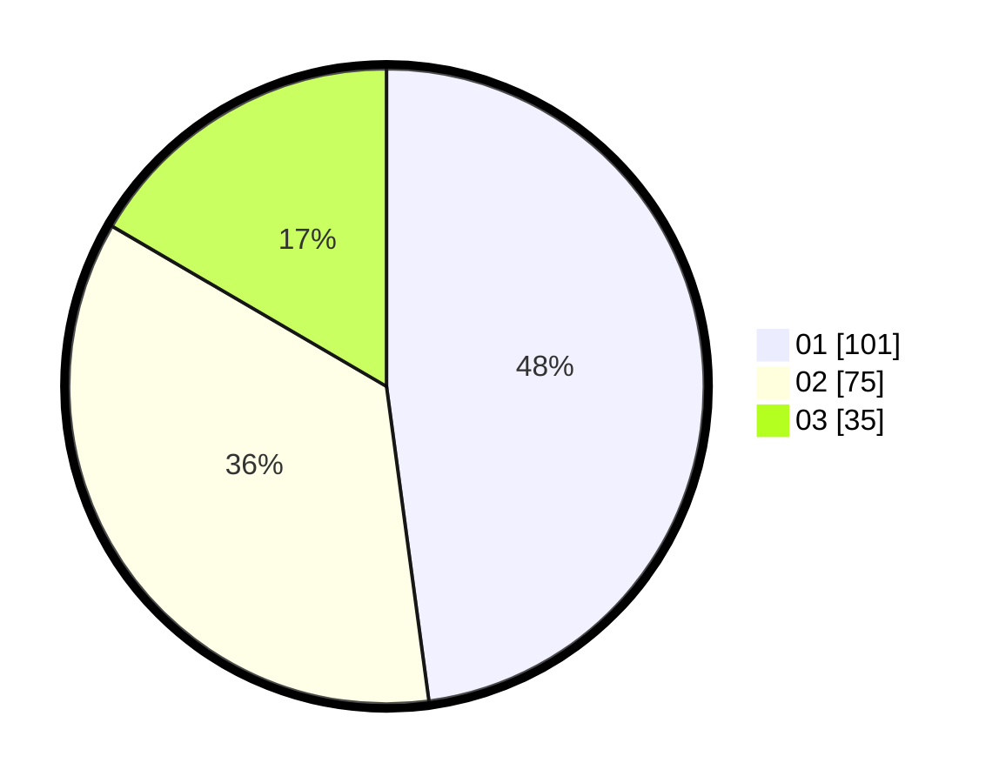

# Hasil

Hasil perolehan suara paslon dapat dilihat pada file paslon-01.txt, paslon-02.txt, dan paslon-03.txt.

Jika tidak ada, artinya data tersebut belum ada pada SIREKAP.

## Perolehan Suara

 * Paslon 01: **101**.
 * Paslon 02: **75**.
 * Paslon 03: **35**.

## Foto C Plano

https://sirekap-obj-formc.kpu.go.id/c8ad/pemilu/ppwp/31/72/03/10/01/3172031001052-20240214-211809--4c501ee2-48d9-43a6-99e7-25dd1ed98240.jpg

https://sirekap-obj-formc.kpu.go.id/c8ad/pemilu/ppwp/31/72/03/10/01/3172031001052-20240214-211416--e9316c83-ae7d-4aed-812f-eea4dc1608e2.jpg

https://sirekap-obj-formc.kpu.go.id/c8ad/pemilu/ppwp/31/72/03/10/01/3172031001052-20240214-211941--a671e5e4-f195-43b4-9849-c25bf132880a.jpg
