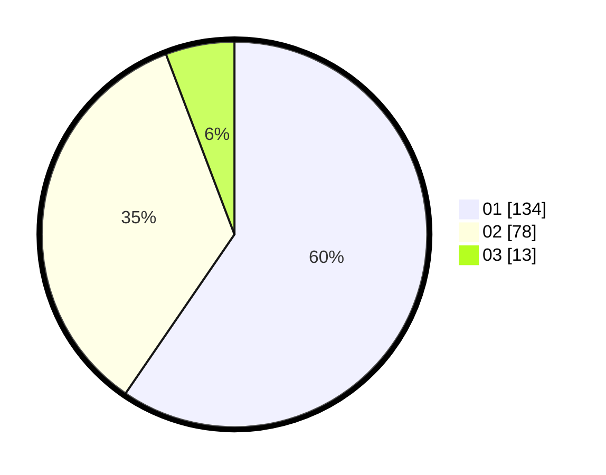

# Hasil

Hasil perolehan suara paslon dapat dilihat pada file paslon-01.txt, paslon-02.txt, dan paslon-03.txt.

Jika tidak ada, artinya data tersebut belum ada pada SIREKAP.

## Perolehan Suara

 * Paslon 01: **134**.
 * Paslon 02: **78**.
 * Paslon 03: **13**.

## Foto C Plano

https://sirekap-obj-formc.kpu.go.id/7390/pemilu/ppwp/31/72/03/10/01/3172031001059-20240214-185754--d55ee5d8-8ea5-41a8-9965-d434e4685994.jpg

https://sirekap-obj-formc.kpu.go.id/7390/pemilu/ppwp/31/72/03/10/01/3172031001059-20240214-193051--dd234e8d-6d2e-41a4-a52e-e8cc9c662b8e.jpg

https://sirekap-obj-formc.kpu.go.id/7390/pemilu/ppwp/31/72/03/10/01/3172031001059-20240215-211611--ad3e5e10-d0f7-4266-ab23-ac98a3aaac70.jpg

## DATA PEMILIH TETAP

Jumlah pemilih dalam DPT: **288**.
 * L: **151**.
 * P: **137**.

## DATA PENGGUNA HAK PILIH

Jumlah pengguna hak pilih dalam DPT: **225**.
 * L: **114**.
 * P: **111**.

Jumlah pengguna hak pilih dalam DPTb: **1**.
 * L: **1**.
 * P: **0**.

Jumlah pengguna hak pilih dalam DPK: **3**.
 * L: **1**.
 * P: **2**.

Jumlah pengguna hak pilih: **229**.
 * L: **116**.
 * P: **113**.

## JUMLAH SUARA SAH DAN TIDAK SAH

JUMLAH SELURUH SUARA SAH: **225**.

JUMLAH SUARA TIDAK SAH: **4**.

JUMLAH SELURUH SUARA SAH DAN SUARA TIDAK SAH: **229**.
