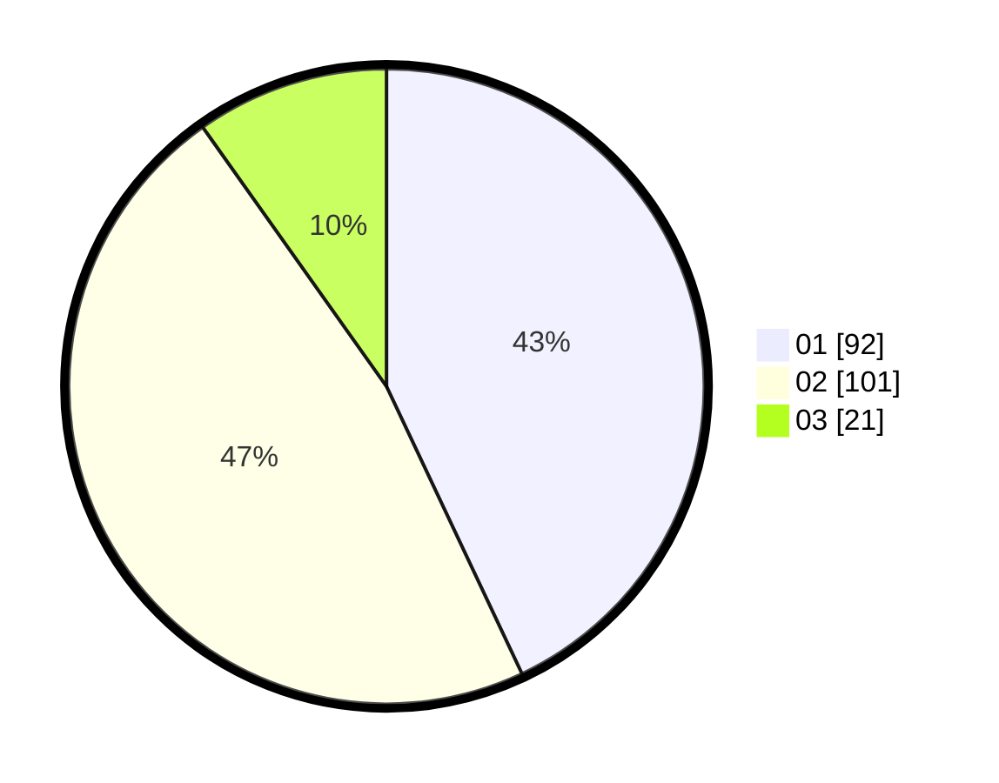

# Hasil

Hasil perolehan suara paslon dapat dilihat pada file paslon-01.txt, paslon-02.txt, dan paslon-03.txt.

Jika tidak ada, artinya data tersebut belum ada pada SIREKAP.

## Perolehan Suara

 * Paslon 01: **92**.
 * Paslon 02: **101**.
 * Paslon 03: **21**.

## Foto C Plano

https://sirekap-obj-formc.kpu.go.id/fdce/pemilu/ppwp/31/72/03/10/01/3172031001076-20240214-190931--986480bf-30e3-44c3-9ac8-92b0ed58b55d.jpg

https://sirekap-obj-formc.kpu.go.id/fdce/pemilu/ppwp/31/72/03/10/01/3172031001076-20240214-191212--50cadbb6-409d-4d1c-bdeb-f9803bc46359.jpg

https://sirekap-obj-formc.kpu.go.id/fdce/pemilu/ppwp/31/72/03/10/01/3172031001076-20240214-191412--8bdb525a-f4ed-4e47-ad76-782879cb1eed.jpg

## DATA PEMILIH TETAP

Jumlah pemilih dalam DPT: **218**.
 * L: **105**.
 * P: **113**.

## DATA PENGGUNA HAK PILIH

Jumlah pengguna hak pilih dalam DPT: **212**.
 * L: **103**.
 * P: **109**.

Jumlah pengguna hak pilih dalam DPTb: **2**.
 * L: **0**.
 * P: **2**.

Jumlah pengguna hak pilih dalam DPK: **4**.
 * L: **2**.
 * P: **2**.

Jumlah pengguna hak pilih: **218**.
 * L: **105**.
 * P: **113**.

## JUMLAH SUARA SAH DAN TIDAK SAH

JUMLAH SELURUH SUARA SAH: **214**.

JUMLAH SUARA TIDAK SAH: **4**.

JUMLAH SELURUH SUARA SAH DAN SUARA TIDAK SAH: **218**.
