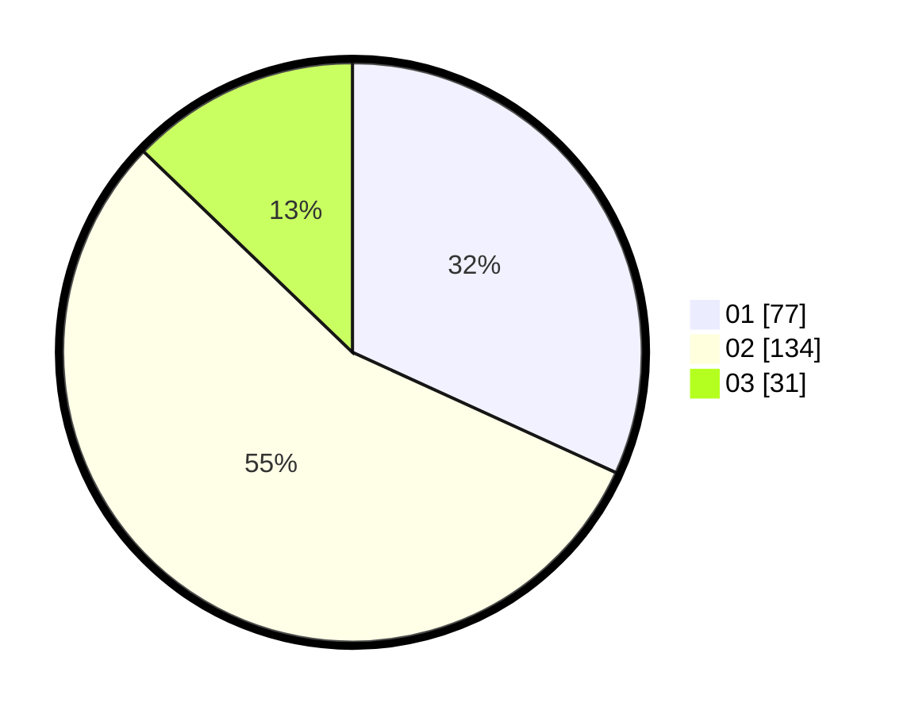

# Hasil

Hasil perolehan suara paslon dapat dilihat pada file paslon-01.txt, paslon-02.txt, dan paslon-03.txt.

Jika tidak ada, artinya data tersebut belum ada pada SIREKAP.

## Perolehan Suara

 * Paslon 01: **77**.
 * Paslon 02: **134**.
 * Paslon 03: **31**.

## Foto C Plano

https://sirekap-obj-formc.kpu.go.id/7b9a/pemilu/ppwp/31/72/03/10/02/3172031002031-20240215-222920--e1e2c518-a789-4f5a-871d-6f1167f04eb1.jpg

https://sirekap-obj-formc.kpu.go.id/7b9a/pemilu/ppwp/31/72/03/10/02/3172031002031-20240215-222922--41bc2595-f38b-4084-ae73-c1119bf467de.jpg

https://sirekap-obj-formc.kpu.go.id/7b9a/pemilu/ppwp/31/72/03/10/02/3172031002031-20240215-222921--218ffb43-cd58-4bae-ad6d-12def1e51bc2.jpg

## DATA PEMILIH TETAP

Jumlah pemilih dalam DPT: **300**.
 * L: **157**.
 * P: **143**.

## DATA PENGGUNA HAK PILIH

Jumlah pengguna hak pilih dalam DPT: **244**.
 * L: **126**.
 * P: **118**.

Jumlah pengguna hak pilih dalam DPTb: **1**.
 * L: **0**.
 * P: **1**.

Jumlah pengguna hak pilih dalam DPK: **2**.
 * L: **1**.
 * P: **1**.

Jumlah pengguna hak pilih: **247**.
 * L: **127**.
 * P: **120**.

## JUMLAH SUARA SAH DAN TIDAK SAH

JUMLAH SELURUH SUARA SAH: **242**.

JUMLAH SUARA TIDAK SAH: **5**.

JUMLAH SELURUH SUARA SAH DAN SUARA TIDAK SAH: **247**.
