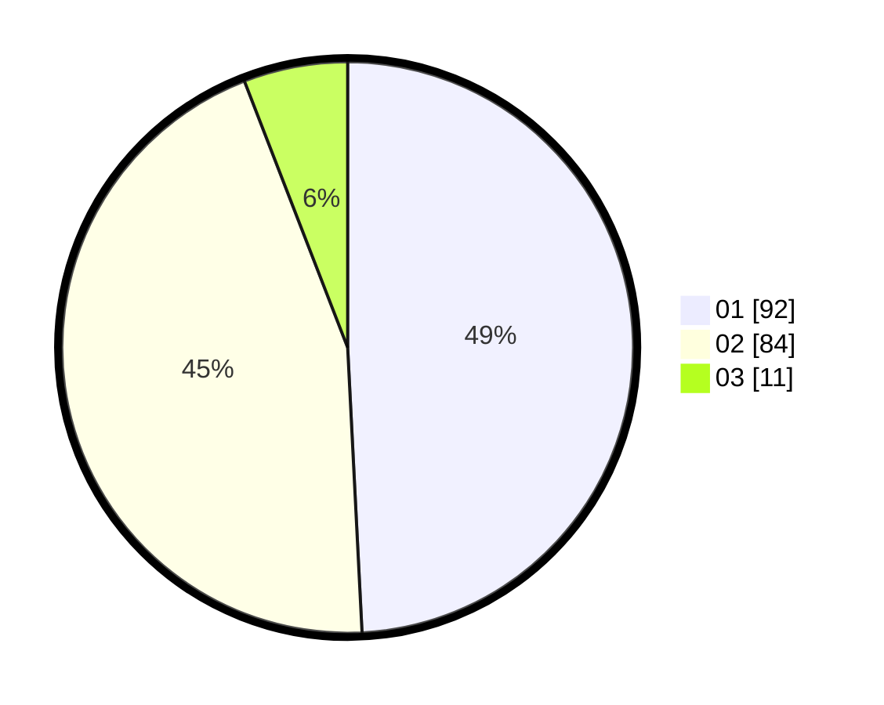

# Hasil

Hasil perolehan suara paslon dapat dilihat pada file paslon-01.txt, paslon-02.txt, dan paslon-03.txt.

Jika tidak ada, artinya data tersebut belum ada pada SIREKAP.

## Perolehan Suara

 * Paslon 01: **92**.
 * Paslon 02: **84**.
 * Paslon 03: **11**.

## Foto C Plano

https://sirekap-obj-formc.kpu.go.id/1706/pemilu/ppwp/31/72/03/10/02/3172031002041-20240214-155523--2bd2d122-5070-4bdd-baa3-9f38fb8db466.jpg

https://sirekap-obj-formc.kpu.go.id/1706/pemilu/ppwp/31/72/03/10/02/3172031002041-20240214-190251--4f1c4313-81af-46b2-8f31-656cae43c77b.jpg

https://sirekap-obj-formc.kpu.go.id/1706/pemilu/ppwp/31/72/03/10/02/3172031002041-20240214-190431--84474a87-4901-4ae7-ade0-84a8b94f46ba.jpg

## DATA PEMILIH TETAP

Jumlah pemilih dalam DPT: **273**.
 * L: **135**.
 * P: **138**.

## DATA PENGGUNA HAK PILIH

Jumlah pengguna hak pilih dalam DPT: **190**.
 * L: **93**.
 * P: **97**.

Jumlah pengguna hak pilih dalam DPTb: **0**.
 * L: **0**.
 * P: **0**.

Jumlah pengguna hak pilih dalam DPK: **0**.
 * L: **0**.
 * P: **0**.

Jumlah pengguna hak pilih: **190**.
 * L: **93**.
 * P: **97**.

## JUMLAH SUARA SAH DAN TIDAK SAH

JUMLAH SELURUH SUARA SAH: **187**.

JUMLAH SUARA TIDAK SAH: **3**.

JUMLAH SELURUH SUARA SAH DAN SUARA TIDAK SAH: **190**.
