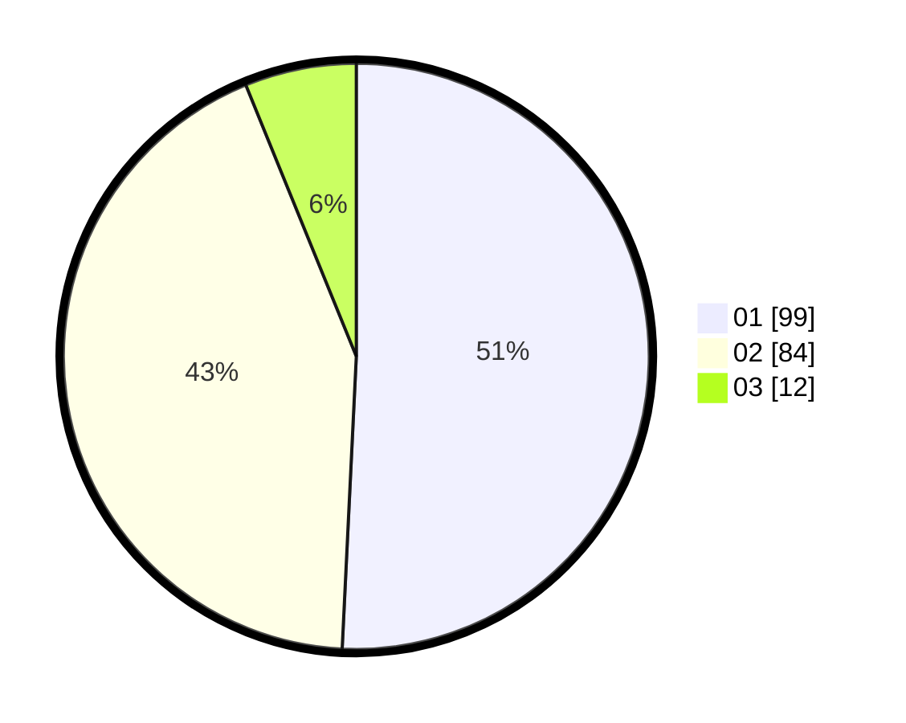

# Hasil

Hasil perolehan suara paslon dapat dilihat pada file paslon-01.txt, paslon-02.txt, dan paslon-03.txt.

Jika tidak ada, artinya data tersebut belum ada pada SIREKAP.

## Perolehan Suara

 * Paslon 01: **99**.
 * Paslon 02: **84**.
 * Paslon 03: **12**.

## Foto C Plano

https://sirekap-obj-formc.kpu.go.id/a006/pemilu/ppwp/31/72/03/10/02/3172031002044-20240215-102533--f06f11fa-c945-44d7-8ff8-014925fc73eb.jpg

https://sirekap-obj-formc.kpu.go.id/a006/pemilu/ppwp/31/72/03/10/02/3172031002044-20240215-153851--a0c8142a-31ac-42d2-86f6-b3cff7a7d523.jpg

https://sirekap-obj-formc.kpu.go.id/a006/pemilu/ppwp/31/72/03/10/02/3172031002044-20240215-154517--1dfbf26f-4a79-4e7d-802a-e1cdfdf15b16.jpg

## DATA PEMILIH TETAP

Jumlah pemilih dalam DPT: **267**.
 * L: **122**.
 * P: **145**.

## DATA PENGGUNA HAK PILIH

Jumlah pengguna hak pilih dalam DPT: **198**.
 * L: **88**.
 * P: **110**.

Jumlah pengguna hak pilih dalam DPTb: **0**.
 * L: **0**.
 * P: **0**.

Jumlah pengguna hak pilih dalam DPK: **0**.
 * L: **0**.
 * P: **0**.

Jumlah pengguna hak pilih: **198**.
 * L: **88**.
 * P: **110**.

## JUMLAH SUARA SAH DAN TIDAK SAH

JUMLAH SELURUH SUARA SAH: **195**.

JUMLAH SUARA TIDAK SAH: **3**.

JUMLAH SELURUH SUARA SAH DAN SUARA TIDAK SAH: **198**.
