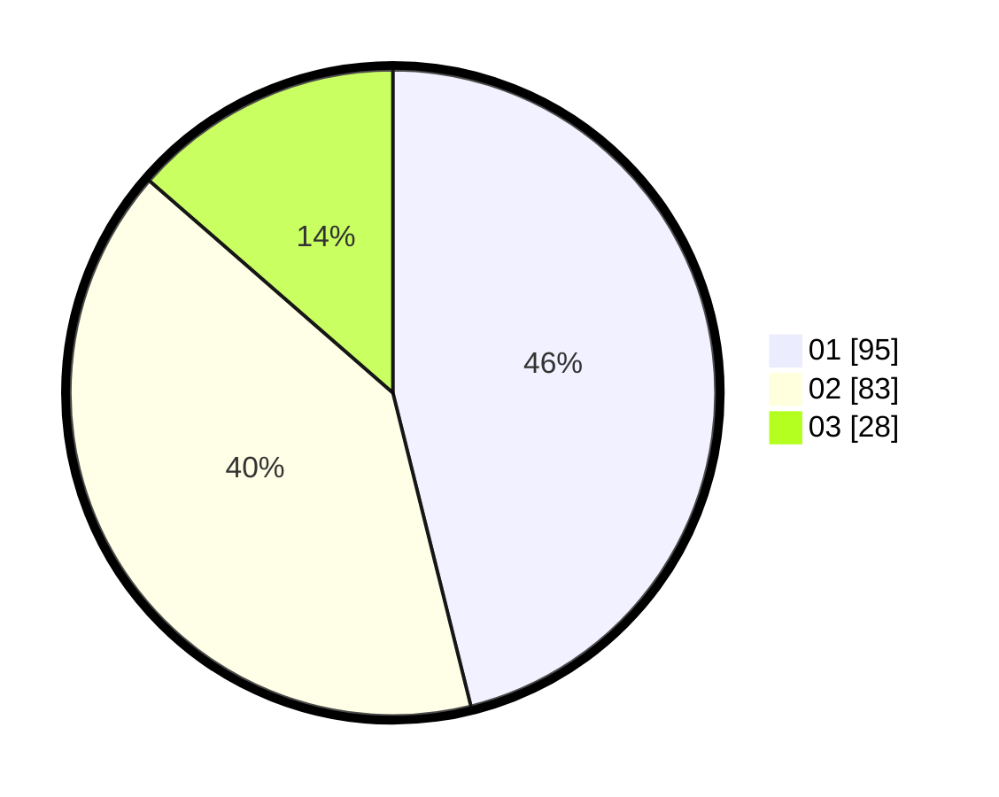

# Hasil

Hasil perolehan suara paslon dapat dilihat pada file paslon-01.txt, paslon-02.txt, dan paslon-03.txt.

Jika tidak ada, artinya data tersebut belum ada pada SIREKAP.

## Perolehan Suara

 * Paslon 01: **95**.
 * Paslon 02: **83**.
 * Paslon 03: **28**.

## Foto C Plano

https://sirekap-obj-formc.kpu.go.id/c7c1/pemilu/ppwp/31/72/03/10/02/3172031002045-20240214-192820--945ed326-5a16-417f-b971-2e1e6b5b176f.jpg

https://sirekap-obj-formc.kpu.go.id/c7c1/pemilu/ppwp/31/72/03/10/02/3172031002045-20240214-191031--b782fd6e-6928-4229-bc10-abb05e6c16dd.jpg

https://sirekap-obj-formc.kpu.go.id/c7c1/pemilu/ppwp/31/72/03/10/02/3172031002045-20240214-191626--c9abf1dc-3a31-4cdc-add6-52f39a41d175.jpg

## DATA PEMILIH TETAP

Jumlah pemilih dalam DPT: **268**.
 * L: **131**.
 * P: **137**.

## DATA PENGGUNA HAK PILIH

Jumlah pengguna hak pilih dalam DPT: **204**.
 * L: **98**.
 * P: **106**.

Jumlah pengguna hak pilih dalam DPTb: **0**.
 * L: **0**.
 * P: **0**.

Jumlah pengguna hak pilih dalam DPK: **4**.
 * L: **2**.
 * P: **2**.

Jumlah pengguna hak pilih: **208**.
 * L: **100**.
 * P: **108**.

## JUMLAH SUARA SAH DAN TIDAK SAH

JUMLAH SELURUH SUARA SAH: **206**.

JUMLAH SUARA TIDAK SAH: **2**.

JUMLAH SELURUH SUARA SAH DAN SUARA TIDAK SAH: **208**.
