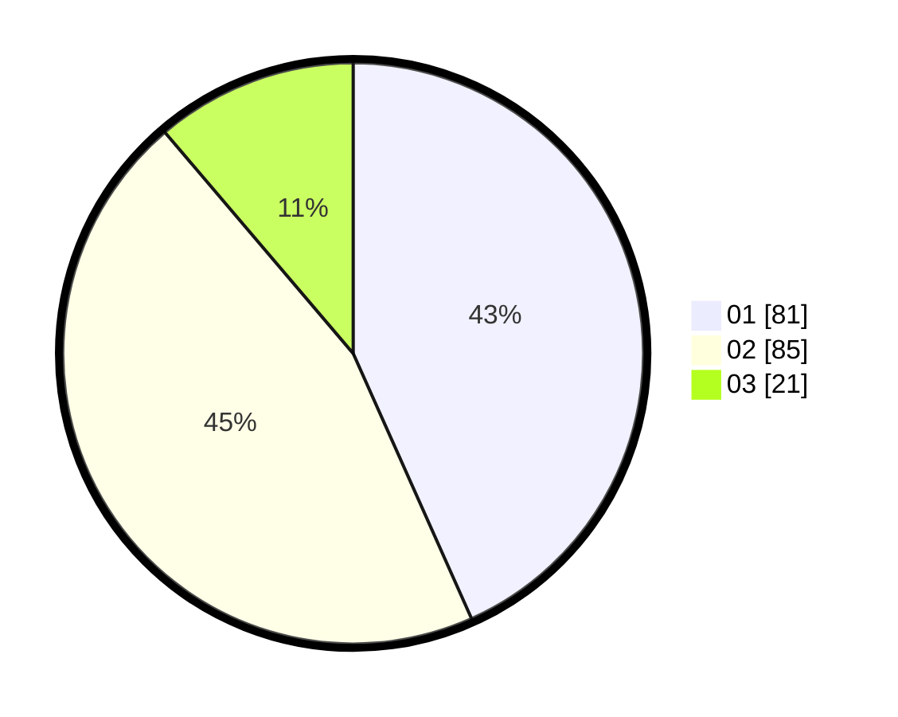

# Hasil

Hasil perolehan suara paslon dapat dilihat pada file paslon-01.txt, paslon-02.txt, dan paslon-03.txt.

Jika tidak ada, artinya data tersebut belum ada pada SIREKAP.

## Perolehan Suara

 * Paslon 01: **81**.
 * Paslon 02: **85**.
 * Paslon 03: **21**.

## Foto C Plano

https://sirekap-obj-formc.kpu.go.id/b3ea/pemilu/ppwp/31/72/03/10/02/3172031002047-20240214-224138--a08f226e-3315-46c2-8721-6c845d2718af.jpg

https://sirekap-obj-formc.kpu.go.id/b3ea/pemilu/ppwp/31/72/03/10/02/3172031002047-20240214-224222--97513b3a-71d0-4918-9860-c5d24b3d0f9d.jpg

https://sirekap-obj-formc.kpu.go.id/b3ea/pemilu/ppwp/31/72/03/10/02/3172031002047-20240214-224309--a6de7c75-ac0a-40af-ac67-f44360db3479.jpg

## DATA PEMILIH TETAP

Jumlah pemilih dalam DPT: **293**.
 * L: **139**.
 * P: **154**.

## DATA PENGGUNA HAK PILIH

Jumlah pengguna hak pilih dalam DPT: **199**.
 * L: **75**.
 * P: **102**.

Jumlah pengguna hak pilih dalam DPTb: **0**.
 * L: **0**.
 * P: **0**.

Jumlah pengguna hak pilih dalam DPK: **0**.
 * L: **0**.
 * P: **0**.

Jumlah pengguna hak pilih: **188**.
 * L: **76**.
 * P: **102**.

## JUMLAH SUARA SAH DAN TIDAK SAH

JUMLAH SELURUH SUARA SAH: **187**.

JUMLAH SUARA TIDAK SAH: **3**.

JUMLAH SELURUH SUARA SAH DAN SUARA TIDAK SAH: **190**.
