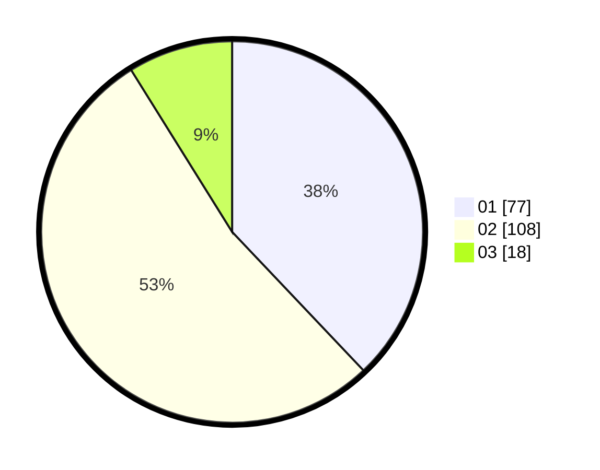

# Hasil

Hasil perolehan suara paslon dapat dilihat pada file paslon-01.txt, paslon-02.txt, dan paslon-03.txt.

Jika tidak ada, artinya data tersebut belum ada pada SIREKAP.

## Perolehan Suara

 * Paslon 01: **77**.
 * Paslon 02: **108**.
 * Paslon 03: **18**.

## Foto C Plano

https://sirekap-obj-formc.kpu.go.id/4b79/pemilu/ppwp/31/72/03/10/02/3172031002069-20240215-023117--0b0769c9-98e2-4399-bce5-ea6478fa16aa.jpg

https://sirekap-obj-formc.kpu.go.id/4b79/pemilu/ppwp/31/72/03/10/02/3172031002069-20240215-023503--18408893-0d72-4332-a2de-536a5c77c389.jpg

https://sirekap-obj-formc.kpu.go.id/4b79/pemilu/ppwp/31/72/03/10/02/3172031002069-20240215-023724--49018ec6-0528-4502-97d9-64413c5e2000.jpg

## DATA PEMILIH TETAP

Jumlah pemilih dalam DPT: **289**.
 * L: **141**.
 * P: **148**.

## DATA PENGGUNA HAK PILIH

Jumlah pengguna hak pilih dalam DPT: **207**.
 * L: **93**.
 * P: **114**.

Jumlah pengguna hak pilih dalam DPTb: **0**.
 * L: **0**.
 * P: **0**.

Jumlah pengguna hak pilih dalam DPK: **0**.
 * L: **0**.
 * P: **0**.

Jumlah pengguna hak pilih: **207**.
 * L: **93**.
 * P: **114**.

## JUMLAH SUARA SAH DAN TIDAK SAH

JUMLAH SELURUH SUARA SAH: **203**.

JUMLAH SUARA TIDAK SAH: **4**.

JUMLAH SELURUH SUARA SAH DAN SUARA TIDAK SAH: **207**.
