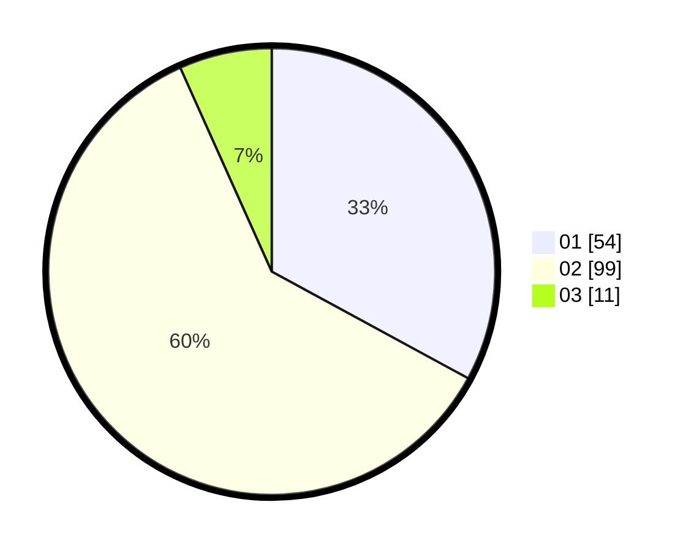

# Hasil

Hasil perolehan suara paslon dapat dilihat pada file paslon-01.txt, paslon-02.txt, dan paslon-03.txt.

Jika tidak ada, artinya data tersebut belum ada pada SIREKAP.

## Perolehan Suara

 * Paslon 01: **54**.
 * Paslon 02: **99**.
 * Paslon 03: **11**.

## Foto C Plano

https://sirekap-obj-formc.kpu.go.id/6264/pemilu/ppwp/31/72/03/10/02/3172031002072-20240214-202746--de8c2d9b-b041-4cb3-b76f-18897a48e2cf.jpg

https://sirekap-obj-formc.kpu.go.id/6264/pemilu/ppwp/31/72/03/10/02/3172031002072-20240214-202823--50822d82-80d8-4b1e-b849-99d4ac8c48e5.jpg

https://sirekap-obj-formc.kpu.go.id/6264/pemilu/ppwp/31/72/03/10/02/3172031002072-20240214-202642--582864a9-bae6-4462-8830-084715806125.jpg

## DATA PEMILIH TETAP

Jumlah pemilih dalam DPT: **230**.
 * L: **115**.
 * P: **115**.

## DATA PENGGUNA HAK PILIH

Jumlah pengguna hak pilih dalam DPT: **166**.
 * L: **80**.
 * P: **86**.

Jumlah pengguna hak pilih dalam DPTb: **0**.
 * L: **0**.
 * P: **0**.

Jumlah pengguna hak pilih dalam DPK: **0**.
 * L: **0**.
 * P: **0**.

Jumlah pengguna hak pilih: **166**.
 * L: **80**.
 * P: **86**.

## JUMLAH SUARA SAH DAN TIDAK SAH

JUMLAH SELURUH SUARA SAH: **164**.

JUMLAH SUARA TIDAK SAH: **2**.

JUMLAH SELURUH SUARA SAH DAN SUARA TIDAK SAH: **166**.
