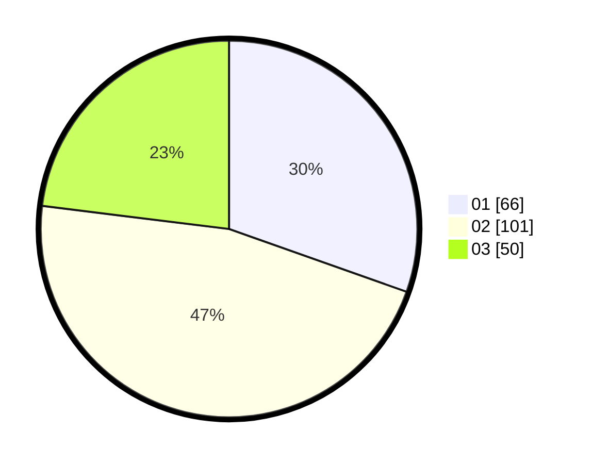

# Hasil

Hasil perolehan suara paslon dapat dilihat pada file paslon-01.txt, paslon-02.txt, dan paslon-03.txt.

Jika tidak ada, artinya data tersebut belum ada pada SIREKAP.

## Perolehan Suara

 * Paslon 01: **66**.
 * Paslon 02: **101**.
 * Paslon 03: **50**.

## Foto C Plano

https://sirekap-obj-formc.kpu.go.id/f529/pemilu/ppwp/31/72/03/10/02/3172031002073-20240214-191003--7abd854a-4763-4ce2-aed3-00f2367612cd.jpg

https://sirekap-obj-formc.kpu.go.id/f529/pemilu/ppwp/31/72/03/10/02/3172031002073-20240214-160055--08f0bdfa-55bf-457d-bcd7-c7538746731d.jpg

https://sirekap-obj-formc.kpu.go.id/f529/pemilu/ppwp/31/72/03/10/02/3172031002073-20240214-162215--83b1e77a-5e81-43d4-8c12-4f77a74e4af0.jpg

## DATA PEMILIH TETAP

Jumlah pemilih dalam DPT: **298**.
 * L: **140**.
 * P: **158**.

## DATA PENGGUNA HAK PILIH

Jumlah pengguna hak pilih dalam DPT: **214**.
 * L: **101**.
 * P: **113**.

Jumlah pengguna hak pilih dalam DPTb: **2**.
 * L: **1**.
 * P: **1**.

Jumlah pengguna hak pilih dalam DPK: **5**.
 * L: **2**.
 * P: **3**.

Jumlah pengguna hak pilih: **221**.
 * L: **104**.
 * P: **117**.

## JUMLAH SUARA SAH DAN TIDAK SAH

JUMLAH SELURUH SUARA SAH: **217**.

JUMLAH SUARA TIDAK SAH: **4**.

JUMLAH SELURUH SUARA SAH DAN SUARA TIDAK SAH: **221**.
