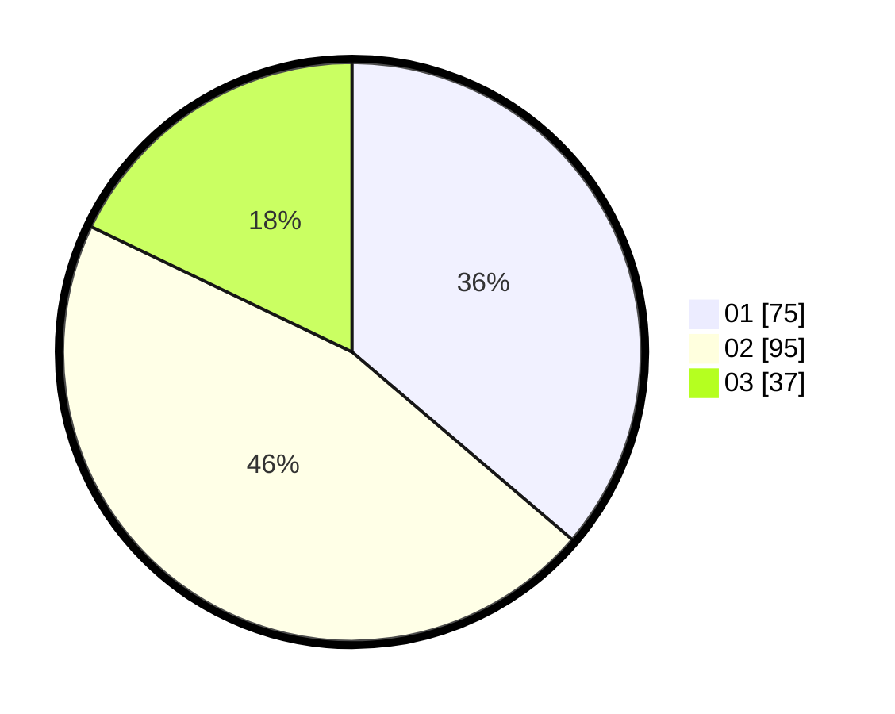

# Hasil

Hasil perolehan suara paslon dapat dilihat pada file paslon-01.txt, paslon-02.txt, dan paslon-03.txt.

Jika tidak ada, artinya data tersebut belum ada pada SIREKAP.

## Perolehan Suara

 * Paslon 01: **75**.
 * Paslon 02: **95**.
 * Paslon 03: **37**.

## Foto C Plano

https://sirekap-obj-formc.kpu.go.id/872c/pemilu/ppwp/31/72/03/10/02/3172031002105-20240214-191322--3ca3b76b-1586-4db8-824a-a931860498c3.jpg

https://sirekap-obj-formc.kpu.go.id/872c/pemilu/ppwp/31/72/03/10/02/3172031002105-20240214-191344--4909781d-f344-4e77-9776-b21b82aa33af.jpg

https://sirekap-obj-formc.kpu.go.id/872c/pemilu/ppwp/31/72/03/10/02/3172031002105-20240214-194822--1d4432ec-fa03-4964-9ab0-912c5a667cd5.jpg

## DATA PEMILIH TETAP

Jumlah pemilih dalam DPT: **287**.
 * L: **146**.
 * P: **141**.

## DATA PENGGUNA HAK PILIH

Jumlah pengguna hak pilih dalam DPT: **209**.
 * L: **101**.
 * P: **108**.

Jumlah pengguna hak pilih dalam DPTb: **0**.
 * L: **0**.
 * P: **0**.

Jumlah pengguna hak pilih dalam DPK: **0**.
 * L: **0**.
 * P: **0**.

Jumlah pengguna hak pilih: **209**.
 * L: **101**.
 * P: **108**.

## JUMLAH SUARA SAH DAN TIDAK SAH

JUMLAH SELURUH SUARA SAH: **208**.

JUMLAH SUARA TIDAK SAH: **1**.

JUMLAH SELURUH SUARA SAH DAN SUARA TIDAK SAH: **209**.
