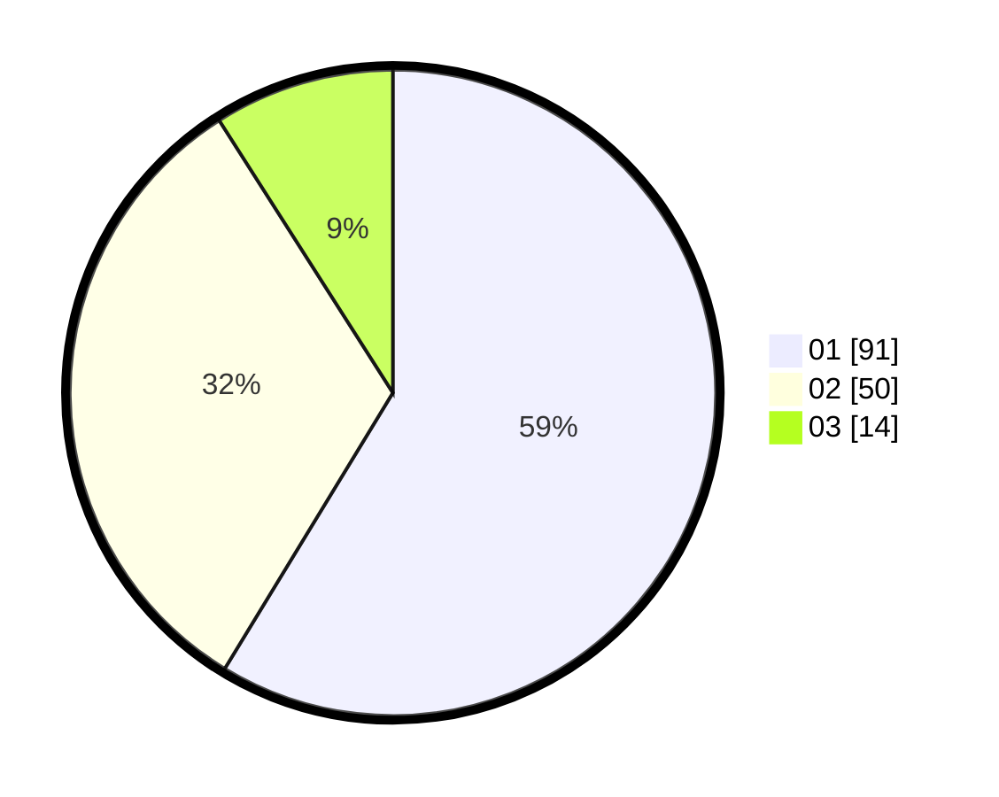

# Hasil

Hasil perolehan suara paslon dapat dilihat pada file paslon-01.txt, paslon-02.txt, dan paslon-03.txt.

Jika tidak ada, artinya data tersebut belum ada pada SIREKAP.

## Perolehan Suara

 * Paslon 01: **91**.
 * Paslon 02: **50**.
 * Paslon 03: **14**.

## Foto C Plano

https://sirekap-obj-formc.kpu.go.id/b1ff/pemilu/ppwp/31/72/03/10/02/3172031002132-20240215-004553--1d8d216b-738a-4577-ba0b-41ed98c3ec46.jpg

https://sirekap-obj-formc.kpu.go.id/b1ff/pemilu/ppwp/31/72/03/10/02/3172031002132-20240215-004559--be319236-f0fd-41ca-a1c9-9b2c1b462dde.jpg

https://sirekap-obj-formc.kpu.go.id/b1ff/pemilu/ppwp/31/72/03/10/02/3172031002132-20240215-004608--f1b03ee5-817e-4150-b890-b8c4c855a0b4.jpg

## DATA PEMILIH TETAP

Jumlah pemilih dalam DPT: **195**.
 * L: **88**.
 * P: **107**.

## DATA PENGGUNA HAK PILIH

Jumlah pengguna hak pilih dalam DPT: **154**.
 * L: **65**.
 * P: **89**.

Jumlah pengguna hak pilih dalam DPTb: **0**.
 * L: **0**.
 * P: **0**.

Jumlah pengguna hak pilih dalam DPK: **1**.
 * L: **1**.
 * P: **0**.

Jumlah pengguna hak pilih: **155**.
 * L: **66**.
 * P: **89**.

## JUMLAH SUARA SAH DAN TIDAK SAH

JUMLAH SELURUH SUARA SAH: **155**.

JUMLAH SUARA TIDAK SAH: **0**.

JUMLAH SELURUH SUARA SAH DAN SUARA TIDAK SAH: **155**.
