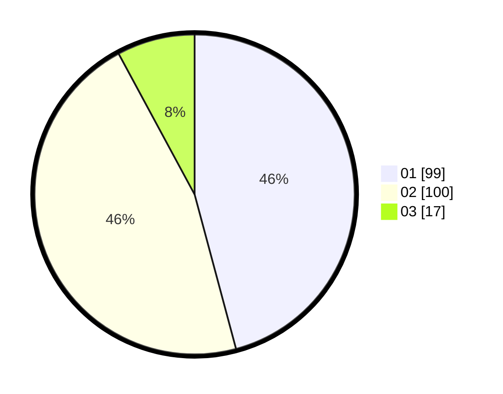

# Hasil

Hasil perolehan suara paslon dapat dilihat pada file paslon-01.txt, paslon-02.txt, dan paslon-03.txt.

Jika tidak ada, artinya data tersebut belum ada pada SIREKAP.

## Perolehan Suara

 * Paslon 01: **99**.
 * Paslon 02: **100**.
 * Paslon 03: **17**.

## Foto C Plano

https://sirekap-obj-formc.kpu.go.id/0efe/pemilu/ppwp/31/72/03/10/02/3172031002139-20240214-155434--f9e2ba5a-5718-46d3-99b5-95630bc05cbf.jpg

https://sirekap-obj-formc.kpu.go.id/0efe/pemilu/ppwp/31/72/03/10/02/3172031002139-20240214-155132--9ecb8229-949d-47bf-b055-5378b69c2d0e.jpg

https://sirekap-obj-formc.kpu.go.id/0efe/pemilu/ppwp/31/72/03/10/02/3172031002139-20240214-155154--0b615a76-a62a-41ff-ae38-d572238a2097.jpg

## DATA PEMILIH TETAP

Jumlah pemilih dalam DPT: **289**.
 * L: **151**.
 * P: **138**.

## DATA PENGGUNA HAK PILIH

Jumlah pengguna hak pilih dalam DPT: **218**.
 * L: **110**.
 * P: **108**.

Jumlah pengguna hak pilih dalam DPTb: **1**.
 * L: **0**.
 * P: **1**.

Jumlah pengguna hak pilih dalam DPK: **2**.
 * L: **1**.
 * P: **1**.

Jumlah pengguna hak pilih: **221**.
 * L: **111**.
 * P: **110**.

## JUMLAH SUARA SAH DAN TIDAK SAH

JUMLAH SELURUH SUARA SAH: **216**.

JUMLAH SUARA TIDAK SAH: **5**.

JUMLAH SELURUH SUARA SAH DAN SUARA TIDAK SAH: **221**.
