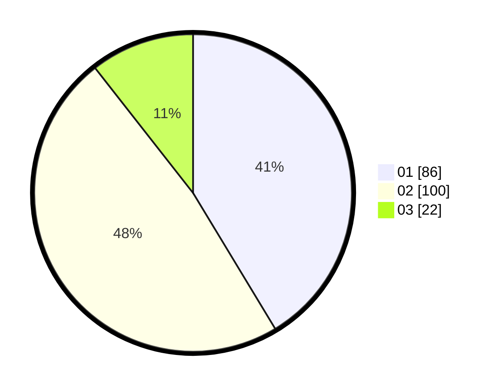

# Hasil

Hasil perolehan suara paslon dapat dilihat pada file paslon-01.txt, paslon-02.txt, dan paslon-03.txt.

Jika tidak ada, artinya data tersebut belum ada pada SIREKAP.

## Perolehan Suara

 * Paslon 01: **86**.
 * Paslon 02: **100**.
 * Paslon 03: **22**.

## Foto C Plano

https://sirekap-obj-formc.kpu.go.id/de05/pemilu/ppwp/31/72/03/10/02/3172031002145-20240215-004258--1ceca12f-0771-4adf-b9a5-1f21a32ff806.jpg

https://sirekap-obj-formc.kpu.go.id/de05/pemilu/ppwp/31/72/03/10/02/3172031002145-20240215-004601--7a43fe8c-a358-4a83-ac8f-eca3842ccb40.jpg

https://sirekap-obj-formc.kpu.go.id/de05/pemilu/ppwp/31/72/03/10/02/3172031002145-20240215-004706--bc937e3f-18ab-4e3b-b46c-3b0d884ceace.jpg

## DATA PEMILIH TETAP

Jumlah pemilih dalam DPT: **291**.
 * L: **138**.
 * P: **153**.

## DATA PENGGUNA HAK PILIH

Jumlah pengguna hak pilih dalam DPT: **212**.
 * L: **95**.
 * P: **117**.

Jumlah pengguna hak pilih dalam DPTb: **0**.
 * L: **0**.
 * P: **0**.

Jumlah pengguna hak pilih dalam DPK: **0**.
 * L: **0**.
 * P: **0**.

Jumlah pengguna hak pilih: **212**.
 * L: **95**.
 * P: **117**.

## JUMLAH SUARA SAH DAN TIDAK SAH

JUMLAH SELURUH SUARA SAH: **208**.

JUMLAH SUARA TIDAK SAH: **4**.

JUMLAH SELURUH SUARA SAH DAN SUARA TIDAK SAH: **212**.
