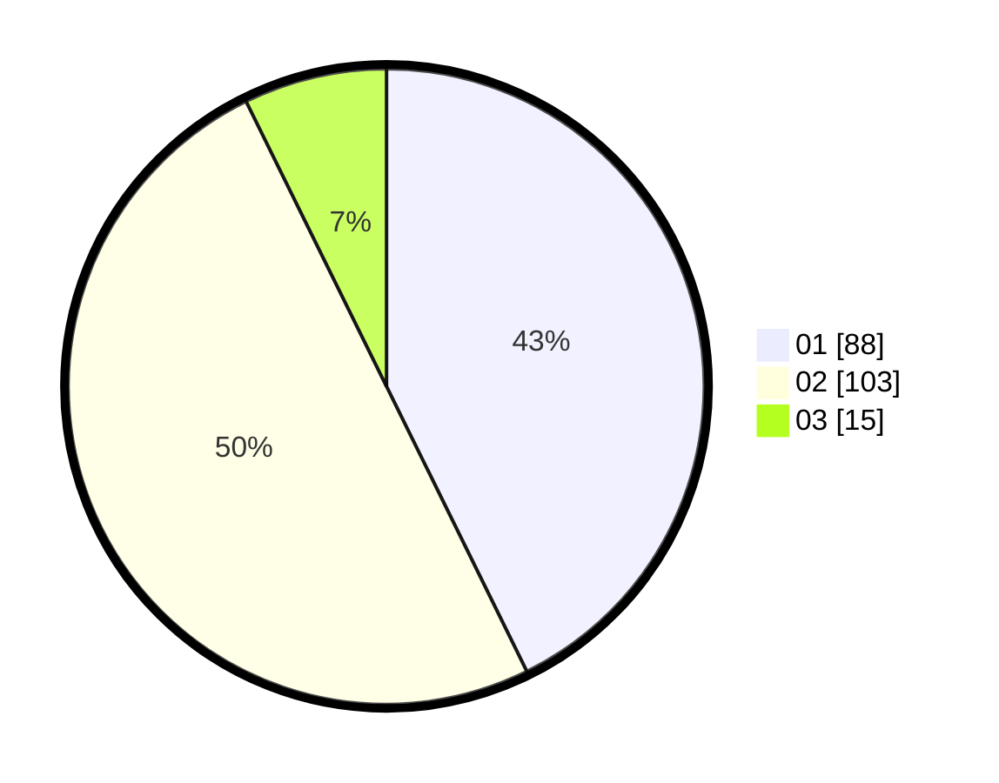

# Hasil

Hasil perolehan suara paslon dapat dilihat pada file paslon-01.txt, paslon-02.txt, dan paslon-03.txt.

Jika tidak ada, artinya data tersebut belum ada pada SIREKAP.

## Perolehan Suara

 * Paslon 01: **88**.
 * Paslon 02: **103**.
 * Paslon 03: **15**.

## Foto C Plano

https://sirekap-obj-formc.kpu.go.id/f51a/pemilu/ppwp/31/72/03/10/02/3172031002146-20240214-200136--aa7f115d-5fa9-4c89-90c6-c1419f28481a.jpg

https://sirekap-obj-formc.kpu.go.id/f51a/pemilu/ppwp/31/72/03/10/02/3172031002146-20240214-200345--685db9cf-0c3e-4d1b-9d9d-68e93af00a13.jpg

https://sirekap-obj-formc.kpu.go.id/f51a/pemilu/ppwp/31/72/03/10/02/3172031002146-20240214-200448--d322188f-dcf7-4289-9546-9f171b9525e2.jpg

## DATA PEMILIH TETAP

Jumlah pemilih dalam DPT: **289**.
 * L: **150**.
 * P: **139**.

## DATA PENGGUNA HAK PILIH

Jumlah pengguna hak pilih dalam DPT: **208**.
 * L: **98**.
 * P: **110**.

Jumlah pengguna hak pilih dalam DPTb: **1**.
 * L: **1**.
 * P: **0**.

Jumlah pengguna hak pilih dalam DPK: **1**.
 * L: **0**.
 * P: **1**.

Jumlah pengguna hak pilih: **210**.
 * L: **99**.
 * P: **111**.

## JUMLAH SUARA SAH DAN TIDAK SAH

JUMLAH SELURUH SUARA SAH: **207**.

JUMLAH SUARA TIDAK SAH: **3**.

JUMLAH SELURUH SUARA SAH DAN SUARA TIDAK SAH: **210**.
