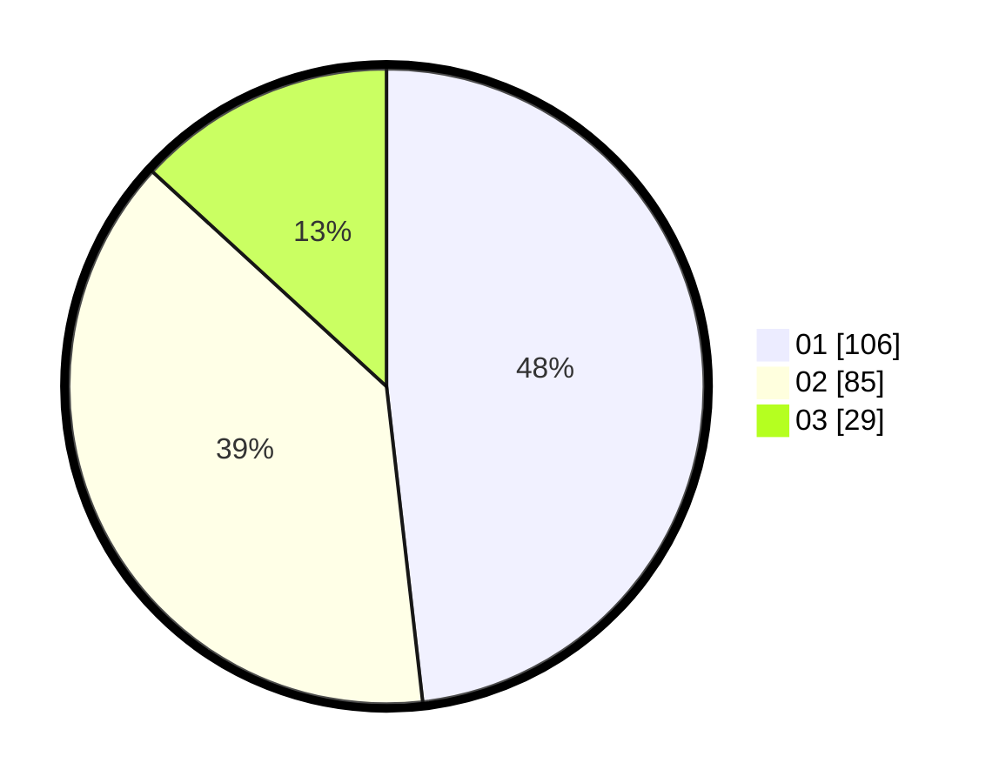

# Hasil

Hasil perolehan suara paslon dapat dilihat pada file paslon-01.txt, paslon-02.txt, dan paslon-03.txt.

Jika tidak ada, artinya data tersebut belum ada pada SIREKAP.

## Perolehan Suara

 * Paslon 01: **106**.
 * Paslon 02: **85**.
 * Paslon 03: **29**.

## Foto C Plano

https://sirekap-obj-formc.kpu.go.id/fd0f/pemilu/ppwp/31/72/03/10/02/3172031002152-20240214-212834--7d13f38e-7ca1-4b44-b4e0-d9b21efd34f2.jpg

https://sirekap-obj-formc.kpu.go.id/fd0f/pemilu/ppwp/31/72/03/10/02/3172031002152-20240214-212913--48fec40d-8772-405a-b71e-56429783197d.jpg

https://sirekap-obj-formc.kpu.go.id/fd0f/pemilu/ppwp/31/72/03/10/02/3172031002152-20240214-212953--b29fc219-781f-4cc7-8f95-89408c7438e1.jpg
