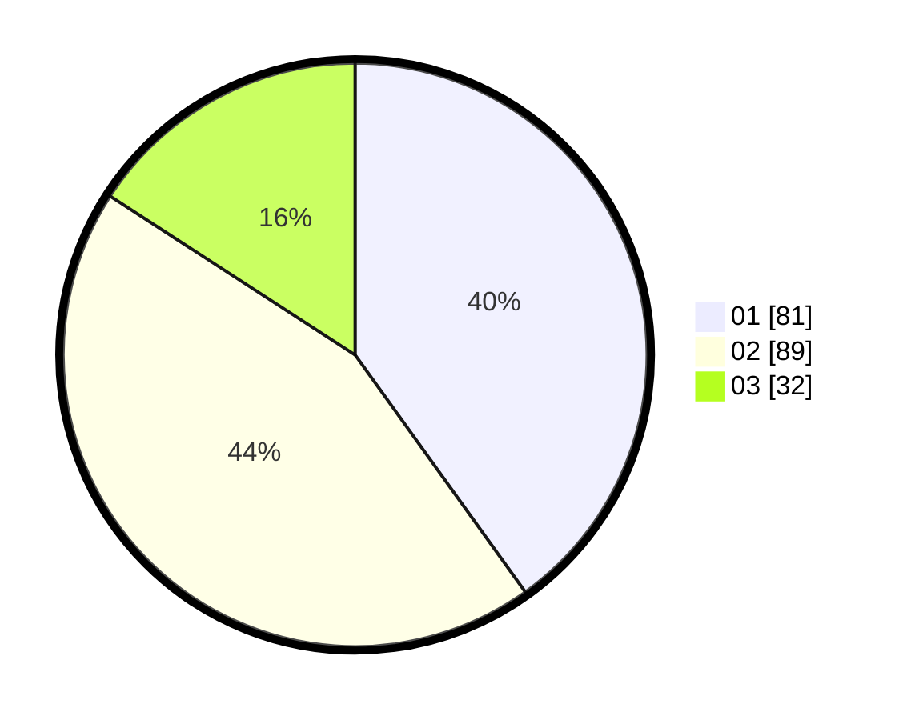

# Hasil

Hasil perolehan suara paslon dapat dilihat pada file paslon-01.txt, paslon-02.txt, dan paslon-03.txt.

Jika tidak ada, artinya data tersebut belum ada pada SIREKAP.

## Perolehan Suara

 * Paslon 01: **81**.
 * Paslon 02: **89**.
 * Paslon 03: **32**.

## Foto C Plano

https://sirekap-obj-formc.kpu.go.id/0a2d/pemilu/ppwp/31/72/03/10/02/3172031002203-20240214-224443--8c575500-eb4d-45f4-9140-75be1e42890f.jpg

https://sirekap-obj-formc.kpu.go.id/0a2d/pemilu/ppwp/31/72/03/10/02/3172031002203-20240214-224632--1ca2c416-456b-4b4c-8b2c-12a61ff19eb3.jpg

https://sirekap-obj-formc.kpu.go.id/0a2d/pemilu/ppwp/31/72/03/10/02/3172031002203-20240214-224732--f8d98a12-db07-4929-94eb-7da2de33abf3.jpg

## DATA PEMILIH TETAP

Jumlah pemilih dalam DPT: **292**.
 * L: **144**.
 * P: **148**.

## DATA PENGGUNA HAK PILIH

Jumlah pengguna hak pilih dalam DPT: **205**.
 * L: **94**.
 * P: **111**.

Jumlah pengguna hak pilih dalam DPTb: **2**.
 * L: **1**.
 * P: **1**.

Jumlah pengguna hak pilih dalam DPK: **1**.
 * L: **1**.
 * P: **0**.

Jumlah pengguna hak pilih: **208**.
 * L: **96**.
 * P: **112**.

## JUMLAH SUARA SAH DAN TIDAK SAH

JUMLAH SELURUH SUARA SAH: **202**.

JUMLAH SUARA TIDAK SAH: **6**.

JUMLAH SELURUH SUARA SAH DAN SUARA TIDAK SAH: **208**.
