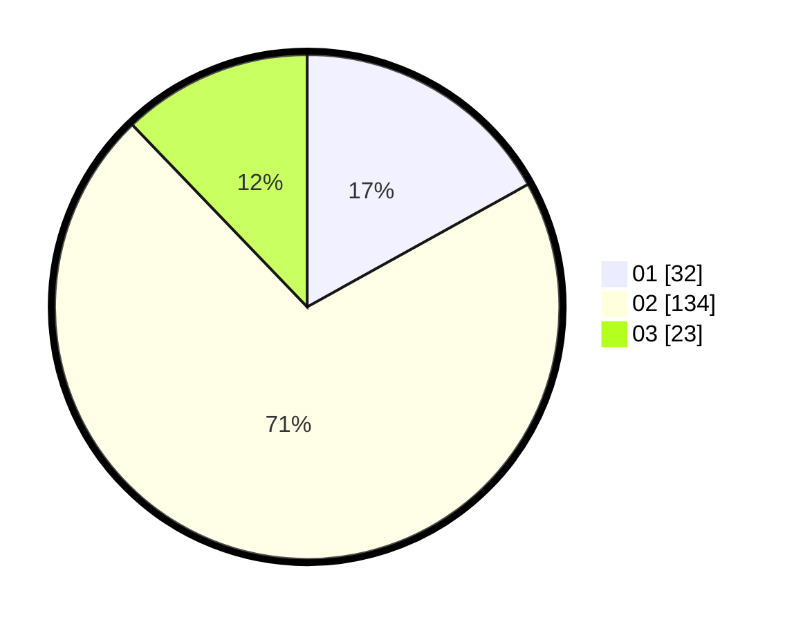

# Hasil

Hasil perolehan suara paslon dapat dilihat pada file paslon-01.txt, paslon-02.txt, dan paslon-03.txt.

Jika tidak ada, artinya data tersebut belum ada pada SIREKAP.

## Perolehan Suara

 * Paslon 01: **32**.
 * Paslon 02: **134**.
 * Paslon 03: **23**.

## Foto C Plano

https://sirekap-obj-formc.kpu.go.id/5e29/pemilu/ppwp/31/72/03/10/02/3172031002212-20240215-162610--d4434d58-dce4-464d-a898-b4fdf75762f1.jpg

https://sirekap-obj-formc.kpu.go.id/5e29/pemilu/ppwp/31/72/03/10/02/3172031002212-20240214-195527--6b2f961c-7002-4a2f-a970-3a8b8c6d4d94.jpg

https://sirekap-obj-formc.kpu.go.id/5e29/pemilu/ppwp/31/72/03/10/02/3172031002212-20240214-195650--b5cd6248-7d95-4036-87bd-1157f1d18445.jpg
