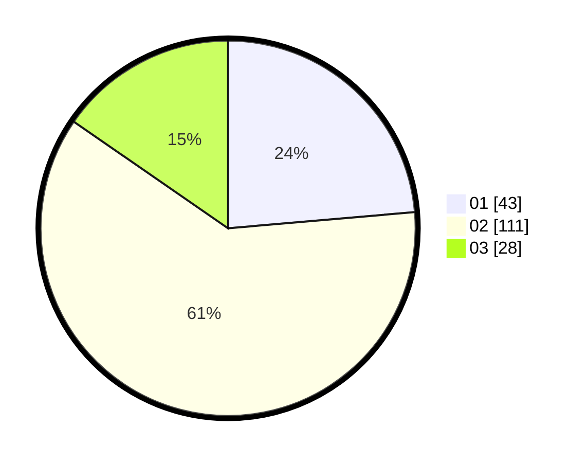

# Hasil

Hasil perolehan suara paslon dapat dilihat pada file paslon-01.txt, paslon-02.txt, dan paslon-03.txt.

Jika tidak ada, artinya data tersebut belum ada pada SIREKAP.

## Perolehan Suara

 * Paslon 01: **43**.
 * Paslon 02: **111**.
 * Paslon 03: **28**.

## Foto C Plano

https://sirekap-obj-formc.kpu.go.id/fe11/pemilu/ppwp/31/72/03/10/02/3172031002218-20240216-131953--547e766d-d1ea-4fb1-9ad5-c11d349539f7.jpg

https://sirekap-obj-formc.kpu.go.id/fe11/pemilu/ppwp/31/72/03/10/02/3172031002218-20240216-131955--2940270d-dcfb-4997-94b7-f1dd1cc5d33d.jpg

https://sirekap-obj-formc.kpu.go.id/fe11/pemilu/ppwp/31/72/03/10/02/3172031002218-20240216-131954--6a7fa552-a751-4854-98b9-62449615f1f3.jpg

## DATA PEMILIH TETAP

Jumlah pemilih dalam DPT: **0**.
 * L: **0**.
 * P: **0**.

## DATA PENGGUNA HAK PILIH

Jumlah pengguna hak pilih dalam DPT: **0**.
 * L: **0**.
 * P: **0**.

Jumlah pengguna hak pilih dalam DPTb: **0**.
 * L: **0**.
 * P: **0**.

Jumlah pengguna hak pilih dalam DPK: **0**.
 * L: **0**.
 * P: **0**.

Jumlah pengguna hak pilih: **0**.
 * L: **0**.
 * P: **0**.

## JUMLAH SUARA SAH DAN TIDAK SAH

JUMLAH SELURUH SUARA SAH: **182**.

JUMLAH SUARA TIDAK SAH: **6**.

JUMLAH SELURUH SUARA SAH DAN SUARA TIDAK SAH: **188**.
