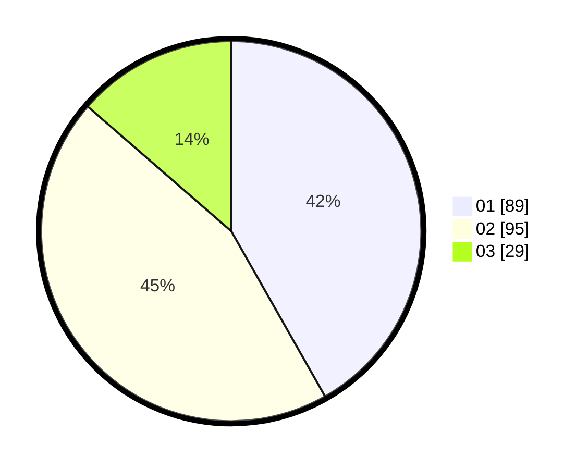

# Hasil

Hasil perolehan suara paslon dapat dilihat pada file paslon-01.txt, paslon-02.txt, dan paslon-03.txt.

Jika tidak ada, artinya data tersebut belum ada pada SIREKAP.

## Perolehan Suara

 * Paslon 01: **89**.
 * Paslon 02: **95**.
 * Paslon 03: **29**.

## Foto C Plano

https://sirekap-obj-formc.kpu.go.id/1511/pemilu/ppwp/31/72/03/10/03/3172031003001-20240216-102358--a4f0ea1b-34f8-40e1-af20-81522f7c4cb0.jpg

https://sirekap-obj-formc.kpu.go.id/1511/pemilu/ppwp/31/72/03/10/03/3172031003001-20240216-102432--7e9434b9-b141-47ae-a91b-717bd3f9d4ad.jpg

https://sirekap-obj-formc.kpu.go.id/1511/pemilu/ppwp/31/72/03/10/03/3172031003001-20240216-102455--adb2271b-a875-44bd-9915-2211a341b4d2.jpg

## DATA PEMILIH TETAP

Jumlah pemilih dalam DPT: **292**.
 * L: **151**.
 * P: **141**.

## DATA PENGGUNA HAK PILIH

Jumlah pengguna hak pilih dalam DPT: **212**.
 * L: **105**.
 * P: **107**.

Jumlah pengguna hak pilih dalam DPTb: **1**.
 * L: **1**.
 * P: **0**.

Jumlah pengguna hak pilih dalam DPK: **0**.
 * L: **0**.
 * P: **0**.

Jumlah pengguna hak pilih: **213**.
 * L: **106**.
 * P: **107**.

## JUMLAH SUARA SAH DAN TIDAK SAH

JUMLAH SELURUH SUARA SAH: **213**.

JUMLAH SUARA TIDAK SAH: **0**.

JUMLAH SELURUH SUARA SAH DAN SUARA TIDAK SAH: **213**.
