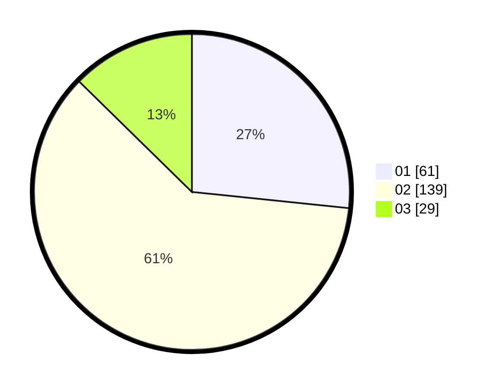

# Hasil

Hasil perolehan suara paslon dapat dilihat pada file paslon-01.txt, paslon-02.txt, dan paslon-03.txt.

Jika tidak ada, artinya data tersebut belum ada pada SIREKAP.

## Perolehan Suara

 * Paslon 01: **61**.
 * Paslon 02: **139**.
 * Paslon 03: **29**.

## Foto C Plano

https://sirekap-obj-formc.kpu.go.id/009e/pemilu/ppwp/31/72/03/10/03/3172031003006-20240215-024742--8d03ff83-b716-4000-8cd4-2ecbca10893b.jpg

https://sirekap-obj-formc.kpu.go.id/009e/pemilu/ppwp/31/72/03/10/03/3172031003006-20240215-024848--523e4ae7-07e7-47d3-991d-50d3f21c2ccb.jpg

https://sirekap-obj-formc.kpu.go.id/009e/pemilu/ppwp/31/72/03/10/03/3172031003006-20240215-025005--c07b2e4b-6b7d-4923-b871-9c65a0b870a5.jpg
