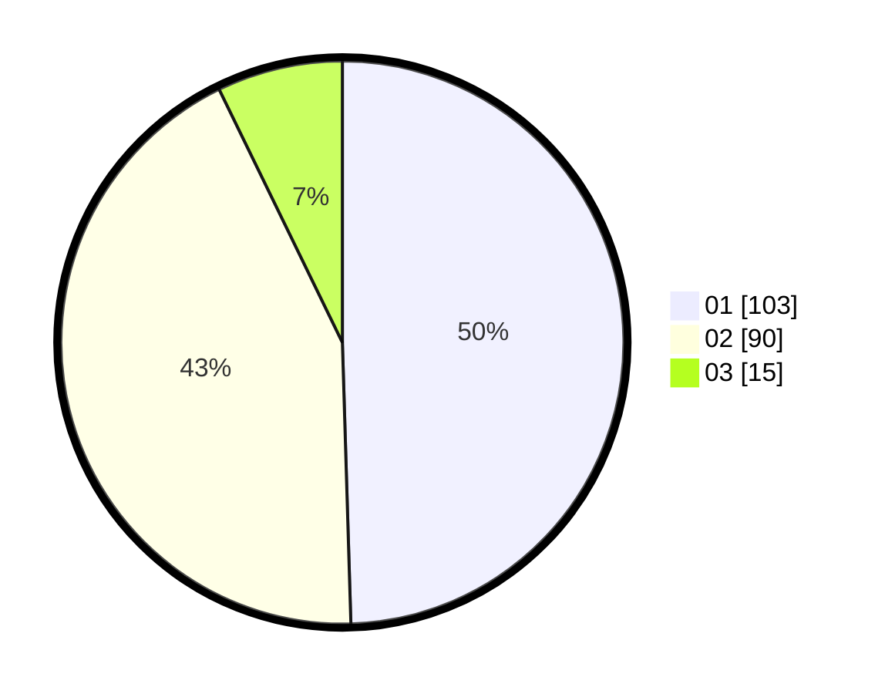

# Hasil

Hasil perolehan suara paslon dapat dilihat pada file paslon-01.txt, paslon-02.txt, dan paslon-03.txt.

Jika tidak ada, artinya data tersebut belum ada pada SIREKAP.

## Perolehan Suara

 * Paslon 01: **103**.
 * Paslon 02: **90**.
 * Paslon 03: **15**.

## Foto C Plano

https://sirekap-obj-formc.kpu.go.id/ac7e/pemilu/ppwp/31/72/03/10/03/3172031003011-20240214-221031--9a1e7386-5413-4d42-8dfa-4697a9473b1c.jpg

https://sirekap-obj-formc.kpu.go.id/ac7e/pemilu/ppwp/31/72/03/10/03/3172031003011-20240214-221211--f3067d77-86eb-4b07-9264-b066605d5ca6.jpg

https://sirekap-obj-formc.kpu.go.id/ac7e/pemilu/ppwp/31/72/03/10/03/3172031003011-20240214-221517--9047191a-29ec-473e-b7b4-8a5067e9343a.jpg
